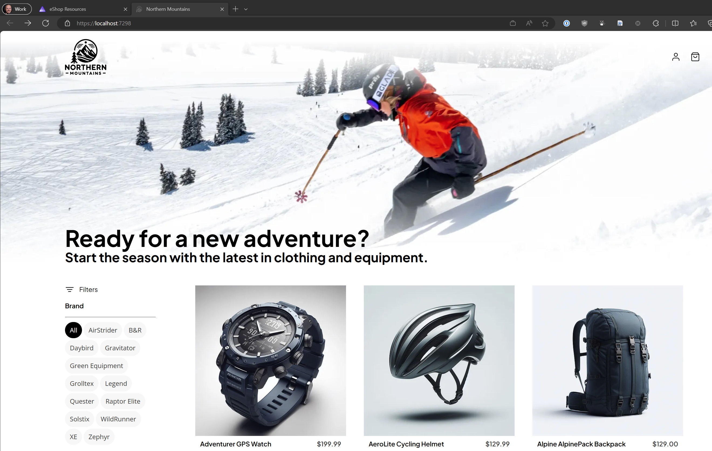

# .NET eShop - App Building Workshop


## What you'll be building

In this workshop, you'll learn by building out features of the [eShop Reference Application](https://github.com/dotnet/eshop). We'll start from File/New and build up to some API back-end applications, a web front-end application, and a [.NET Aspire](https://learn.microsoft.com/dotnet/aspire/get-started/aspire-overview) [AppHost project](https://learn.microsoft.com/dotnet/aspire/fundamentals/app-host-overview#app-host-project) to coordinate them all together.



## Setup

### Using Windows and Visual Studio

If you're on Windows and using Visual Studio, you must use [Visual Studio 2022 Preview](https://visualstudio.com/preview) (version 17.10.0 Preview 5.0 or later). The preview version of Visual Studio 2022 is safe to install side-by-side with the release version. We recommend using Visual Studio 2022 Preview if you're on Windows as it includes support for working with .NET Aspire projects.

> Note: When installing Visual Studio you only need to install the `ASP.NET and web development` workload.

If you're in an instructor-led workshop session and have issues downloading the installers we may have USB sticks with offline installers for you to use.

### Using macOS, Linux, or Windows but not using Visual Studio

If you're using macOs or Linux, or on Windows but don't want to use Visual Studio, you must [download](https://www.microsoft.com/net/download) and install the .NET SDK (version 8.0.100 or newer). You can use the editor or IDE of your choice but note that some operations might be more difficult due to lack of support for .NET Aspire at this time.

### Updating and installing the .NET SDK workload for Aspire

After installing Visual Studio Preview or the required .NET SDK, you will need to update and install the .NET SDK workload for Aspire. This workshop is using the latest version of .NET Aspire (8.1). For your convenience, scripts are provided in this repository to make this process easy:

1. Clone [this repo](https://github.com/dotnet-presentations/eshop-app-workshop) to your machine.
1. In your terminal, navigate to the repo root and run the command `dotnet --version` to verify you are using version 8.0.100 or later of the .NET SDK:

    ```shell
    dotnet --version
    ```

1. Run the `build.cmd` or `build.sh` script in the root of this repo, as appropriate for your operating system and terminal:

    ```shell
    build.cmd
    ```

    ```shell
    build.sh
    ```

1. This script will download and install the latest version of the Aspire workload, followed by building all solutions in this repo.
1. If your machine is successfully configured, you should see a message indicating the build succeeded:

    ```shell
    Build succeeded.
    0 Warning(s)
    0 Error(s)
    ```

## Labs

The workshop consists of a series of labs, over which you'll build the eShop application.

1. [Create the Catalog API](./labs/1-Create-Catalog-API/)
2. [Create the Blazor frontend](./labs/2-Create-Blazor-Frontend/)
3. [Add an Identity Provider & authentication](./labs/3-Add-Identity/)
4. [Add shopping basket capabilities](./labs/4-Add-Shopping-Basket/)
5. [Add checkout & order capabilities](./labs/5-Add-Checkout/)
6. [Add resiliency](./labs/6-Add-Resiliency/)
7. [Deployment](./labs/7-Deployment/)
