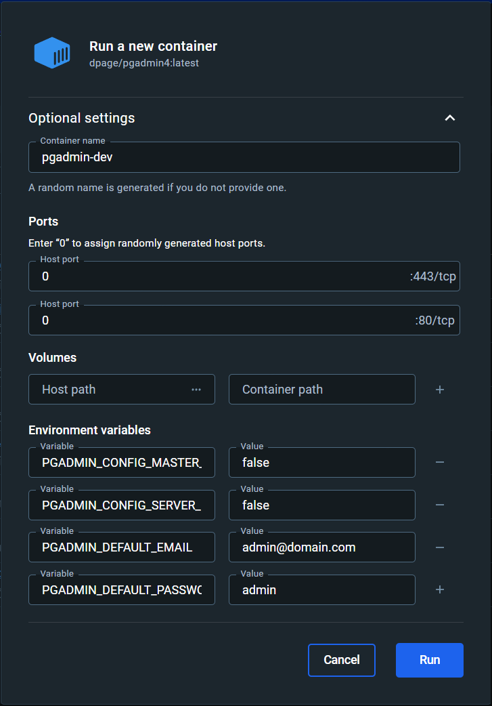
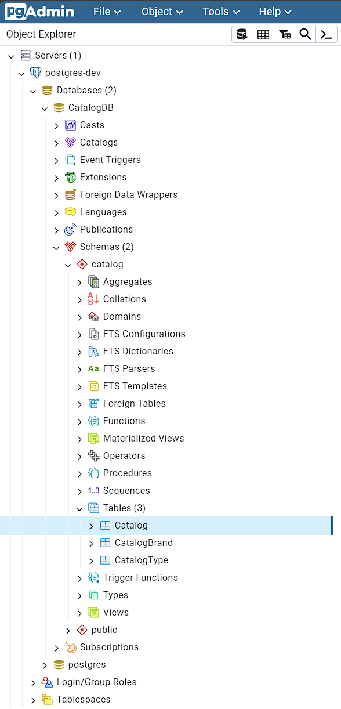
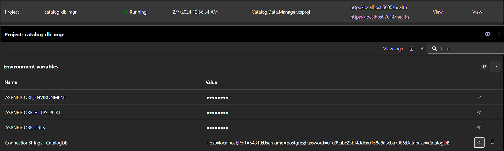
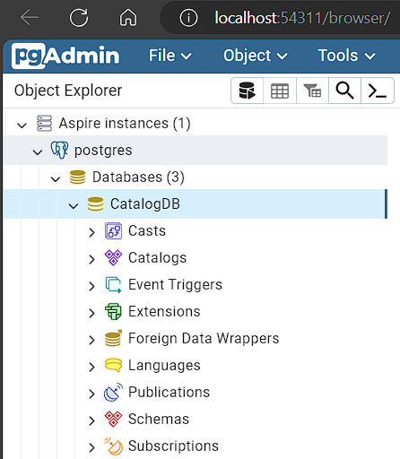

# Create an HTTP API for the product catalog 

A database has already been defined to store the product catalog for eShop, along with an Entity Framework Core model, and a web app that ensures the database is created and updated to the latest schema by running migrations on startup.


## Getting familiar with the Catalog Database & Entity Framework Core Model

1. Open the [`eShop.sln`](./src/eShop.sln) in Visual Studio or VS Code.
1. An Entity Framework Core model is already defined for this database in the `Catalog.Data` project. Open the `CatalogDbContext.cs` file in this project and look at the code to see that the the various tables are defined via properties and [classes implementing `IEntityTypeConfiguration<TEntity>`](https://learn.microsoft.com/ef/core/modeling/#grouping-configuration).
1. The `Catalog.Data` project only defines the `DbContext` and entity types. The [EF Core migrations](https://learn.microsoft.com/ef/core/managing-schemas/migrations/) are defined and managed in the `Catalog.Data.Manager` project. This is a web project that includes some custom code to facilitate creating and seeding the database when the application starts.
1. Open the `Program.cs` file in the `Catalog.Data.Manager` project and take a few minutes to read the code, navigating to the definition/implementation of the `AddMigration<TContext>` method to get a sense of what it's doing to coordinate the creation of the database, application of migrations, and execution of the custom `IDbSeeder<TContext>` class. Also note the [custom health check](https://learn.microsoft.com/aspnet/core/host-and-deploy/health-checks#create-health-checks) that indicates the status of the database initialization.

## Creating Docker containers for the database

In order to successfully run the the `Catalog.Data.Manager` application and see the database be created, a PostgreSQL database server is required. The project is pre-configured to connect to a local server using *trust* authentication in its `appsettings.Development.json` file. Docker is a simple way to run instances of databases for development.

1. Using Docker, create a container to host the PostgreSQL server with the following details:
    - Name: `postgres-dev` 
    - Image: `postgres:latest`
    - Ports: `5432`
    - Environment variables:
      - `POSTGRES_HOST_AUTH_METHOD` : `trust`

    
1. Create another container to host an instance of [pgAdmin](https://www.pgadmin.org/). This will make it easy to inspect the database using a visual tool:
    - Name: `pgadmin-dev` 
    - Image: `dpage/pgadmin4:latest`
    - Ports: `0` (random)
    - Environment variables:
      - `PGADMIN_CONFIG_MASTER_PASSWORD_REQUIRED` : `False`
      - `PGADMIN_CONFIG_SERVER_MODE` : `False`
      - `PGADMIN_DEFAULT_EMAIL` : `admin@domain.com`
      - `PGADMIN_DEFAULT_PASSWORD` : `admin`

    

## Running the `Catalog.Data.Manager` app

1. Launch the `Catalog.Data.Manager` project and navigate to its `/health` endpoint in the browser.
1. The application's logs will be shown in its console instance and will show the detail of it initializing the database. Once initialization has completed, the `/health` endpoint should return a **Healthy** response.

    

1. Stop the application and try launching it again and seeing the output of the `/health` endpoint return `Degraded` while the database initialization is still in progress.
1. Open the pgAdmin UI in another browser tab (find the host port assigned to the container's endpoint on port 80 in the Docker UI) and add the local PostgreSQL server instance by right-clicking on the **Servers** node in the tree-view and selecting **Register > Server** (use `localhost` in the **Connection** tab).
1. Expand the tree-view nodes under the server node you registered to see the that the tables representing the Entity Framework Core model have been created.

    

## Using .NET Aspire to manage container instances

Containers are extremely useful for hosting service dependencies, but rather than creating and connecting to them manually, we can use the features of .NET Aspire to drive this from C#.

1. In Visual Studio, right-mouse click on the `Catalog.Data.Manager` project and select **Add > .NET Aspire Orchestrator Support...** and click OK in the displayed dialog:

    

1. Two new projects were added to the solution: `eShop.AppHost` and `eShop.ServiceDefaults`. The AppHost project should also be set as the launch project for the solution.
1. Open the `Program.cs` file in the AppHost project and change the name assigned to the `Projects.Catalog_Data_Manager` project to `"catalog-db-mgr"`:

    ```csharp
    var builder = DistributedApplication.CreateBuilder(args);
    
    builder.AddProject<Projects.Catalog_Data_Manager>("catalog-db-mgr");
    
    builder.Build().Run();
    ```

1. Use the methods on the `builder` variable to create a PostgreSQL instance called `postgres` with pgAdmin enabled, and a database called `CatalogDB`. Ensure that the `catalog-db-mgr` project resource is configured with a reference to the `catalogDb`:

    ```csharp
    var builder = DistributedApplication.CreateBuilder(args);
    
    var postgres = builder.AddPostgres("postgres")
                          .WithPgAdmin();
    var catalogDb = postgres.AddDatabase("CatalogDB");

    builder.AddProject<Projects.Catalog_Data_Manager>("catalog-db-mgr")
        .WithReference(catalogDb);
    
    builder.Build().Run();
    ```

1. Launch the AppHost project and see that the Aspire dashboard is opened in the browser, with the variaous resources that make up our new distributed application listed, including the `Catalog.Data.Manager` project and the Docker containers.
1. Use the dashboard to inspect the environment variables of the `catalog-db.mgr` resource and notice that it includes one that sets the connection string required to connect to the `CatalogDB` database:

    

    This environment variable will automatically override the value specified in the project's **appsettings.Development.json** file as configuration values provided from environmant variables have higher precedence than those from **appsettings.json** files by default.
1. Locate the pgAdmin resource in the dashboard and click on the hyperlink displayed for it in the **Endpoints** column. Note that the PostgreSQL server defined via the AppHost project was automatically registered with pgAdmin in the **Aspire instances** node:

    

## Create the Catalog API project

