# Create an HTTP API for the product catalog 

A database has already been defined to store the product catalog for eShop, along with an Entity Framework Core model, and a web app that ensures the database is created and updated to the latest schema by running migrations on startup.

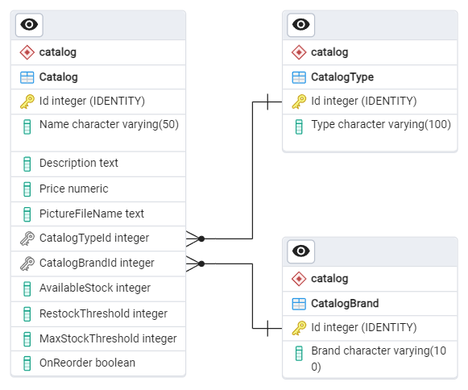

## Getting familiar with the Catalog Database & Entity Framework Core Model

1. Open the [`eShop.lab1.sln`](./src/eShop.lab1.sln) in Visual Studio or VS Code.
1. An Entity Framework Core model is already defined for this database in the `Catalog.Data` project. Open the `CatalogDbContext.cs` file in this project and look at the code to see that the the various tables are defined via properties and [classes implementing `IEntityTypeConfiguration<TEntity>`](https://learn.microsoft.com/ef/core/modeling/#grouping-configuration).
1. The `Catalog.Data` project only defines the `DbContext` and entity types. The [EF Core migrations](https://learn.microsoft.com/ef/core/managing-schemas/migrations/) are defined and managed in the `Catalog.Data.Manager` project. This is a web project that includes some custom code to facilitate creating and seeding the database when the application starts.
1. Open the `Program.cs` file in the `Catalog.Data.Manager` project and take a few minutes to read the code, navigating to the definition/implementation of the `AddMigration<TContext>` method to get a sense of what it's doing to coordinate the creation of the database, application of migrations, and execution of the custom `IDbSeeder<TContext>` class. Also note the [custom health check](https://learn.microsoft.com/aspnet/core/host-and-deploy/health-checks#create-health-checks) that indicates the status of the database initialization.

## Creating Docker containers for the database

In order to successfully run the the `Catalog.Data.Manager` application and see the database be created, a PostgreSQL database server is required. The project is pre-configured to connect to a local server using *trust* authentication in its `appsettings.Development.json` file. Docker is a simple way to run instances of databases for development.

We're going to run 2 docker container:, the PostgreSQL container, and [pgAdmin](https://www.pgadmin.org/). This will make it easy to inspect the database using a visual tool:

### Docker CLI

postgres

```
docker run --name postgres-dev -e POSTGRES_HOST_AUTH_METHOD=trust -p 5432:5432 -d postgres
```

pgAdmin

```
docker run --name pgadmin-dev -e PGADMIN_CONFIG_MASTER_PASSWORD_REQUIRED=False -e PGADMIN_CONFIG_SERVER_MODE=False -e PGADMIN_DEFAULT_EMAIL=admin@domain.com -e PGADMIN_DEFAULT_PASSWORD=admin -p 0:80 -d dpage/pgadmin4
```

### Docker Desktop

1. Using Docker, create a container to host the PostgreSQL server with the following details:
    - Name: `postgres-dev` 
    - Image: `postgres:latest`
    - Ports: `5432`
    - Environment variables:
      - `POSTGRES_HOST_AUTH_METHOD` : `trust`

    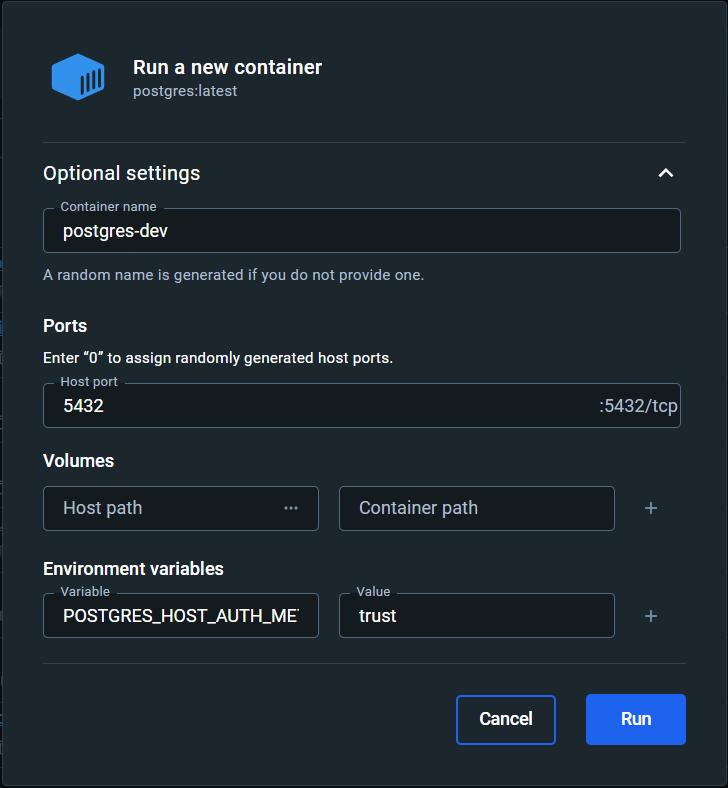
1. Create another container to host an instance of [pgAdmin](https://www.pgadmin.org/):
    - Name: `pgadmin-dev` 
    - Image: `dpage/pgadmin4:latest`
    - Ports: `0` (random)
    - Environment variables:
      - `PGADMIN_CONFIG_MASTER_PASSWORD_REQUIRED` : `False`
      - `PGADMIN_CONFIG_SERVER_MODE` : `False`
      - `PGADMIN_DEFAULT_EMAIL` : `admin@domain.com`
      - `PGADMIN_DEFAULT_PASSWORD` : `admin`

    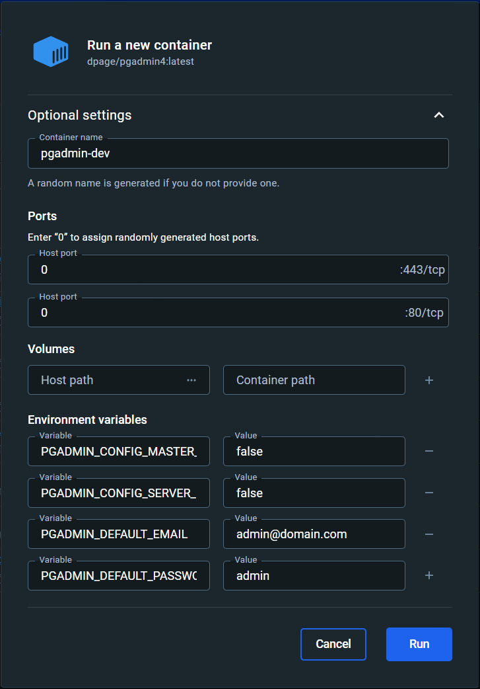

## Running the `Catalog.Data.Manager` app

1. Launch the `Catalog.Data.Manager` project and navigate to its `/health` endpoint in the browser.
1. The application's logs will be shown in its console instance and will show the detail of it initializing the database. Once initialization has completed, the `/health` endpoint should return a **Healthy** response.

    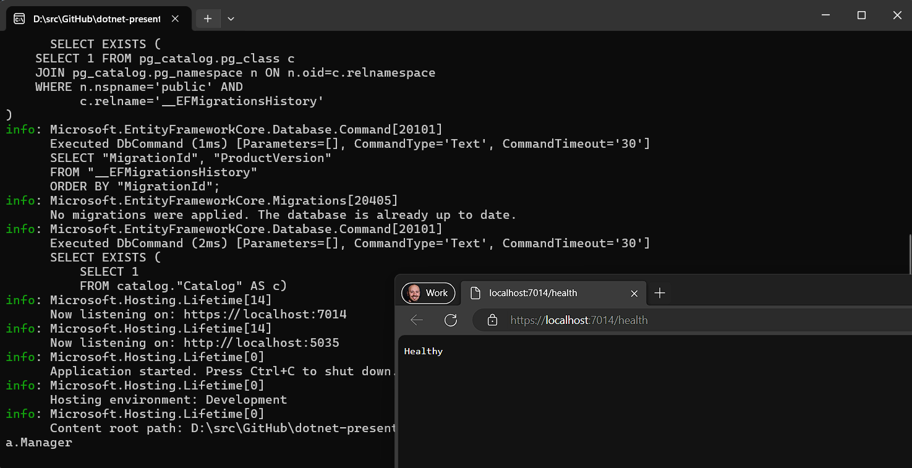

1. Stop the application and try launching it again and seeing the output of the `/health` endpoint return `Degraded` while the database initialization is still in progress.
1. Find the port assigned to the pgAdmin container.

**Docker CLI**

```
docker ps
```

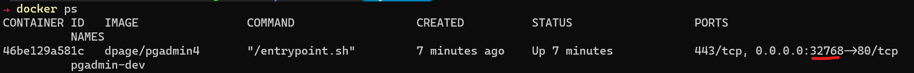

**Docker Desktop**

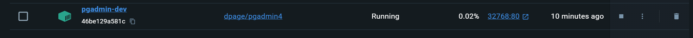

1. Open the pgAdmin UI in another browser tab and add the local PostgreSQL server instance by right-clicking on the **Servers** node in the tree-view and selecting **Register > Server** (use `host.docker.internal` in the **Connection** tab).
1. Expand the tree-view nodes under the server node you registered to see the that the tables representing the Entity Framework Core model have been created.

    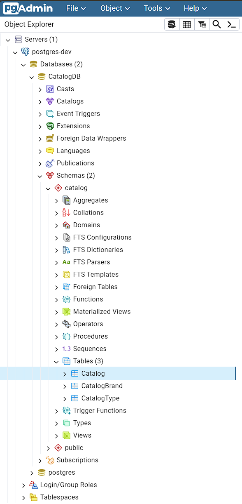

## Using .NET Aspire to manage container instances

Containers are extremely useful for hosting service dependencies, but rather than creating and connecting to them manually, we can use the features of .NET Aspire to drive this from C#.

### Visual Studio

1. In Visual Studio, right-mouse click on the `Catalog.Data.Manager` project and select **Add > .NET Aspire Orchestrator Support...**. Change the *Project name prefix* to "eShop" and click OK in the displayed dialog:

    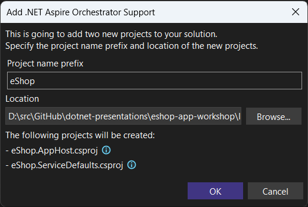

1. Two new projects were added to the solution: `eShop.AppHost` and `eShop.ServiceDefaults`. The AppHost project should also be set as the launch project for the solution.

1. Open the `Program.cs` file in the AppHost project and change the name assigned to the `Projects.Catalog_Data_Manager` project to `"catalog-db-mgr"`:

    ```csharp
    var builder = DistributedApplication.CreateBuilder(args);
    
    builder.AddProject<Projects.Catalog_Data_Manager>("catalog-db-mgr");
    
    builder.Build().Run();
    ```

### dotnet CLI

1. Run the following commands in the `src` folder to create the `eShop.AppHost` and `eShop.ServiceDefaults` projects.

    ```
    dotnet new aspire-apphost -n eShop.AppHost
    dotnet new aspire-servicedefaults -n eShop.ServiceDefaults
    dotnet sln add eShop.AppHost
    dotnet sln add eShop.ServiceDefaults
    ```

1. Now add a reference to the `eShop.AppHost`:

    ```
    cd eShop.AppHost
    dotnet add reference ..\Catalog.Data.Manager
    ```

1. Open the `Program.cs` file in the AppHost project and add the following code:

    ```csharp
    var builder = DistributedApplication.CreateBuilder(args);
    
    builder.AddProject<Projects.Catalog_Data_Manager>("catalog-db-mgr");
    
    builder.Build().Run();
    ```

### Configuring PostgreSQL and pgAdmin

1. Install the `Aspire.Hosting.PostgreSQL` package in the `eShop.AppHost` project:

    ```shell
    dotnet add package Aspire.Hosting.PostgreSQL
    ```

    ```xml
    <PackageReference Include="Aspire.Hosting.PostgreSQL" Version="8.1.0" />
    ```

1. Use the methods on the `builder` variable to create a PostgreSQL instance called `postgres` with pgAdmin enabled, and a database called `CatalogDB`. Ensure that the `catalog-db-mgr` project resource is configured with a reference to the `catalogDb`:

    ```csharp
    var builder = DistributedApplication.CreateBuilder(args);
    
    var postgres = builder.AddPostgres("postgres")
                          .WithPgAdmin();
    var catalogDb = postgres.AddDatabase("CatalogDB");

    builder.AddProject<Projects.Catalog_Data_Manager>("catalog-db-mgr")
        .WithReference(catalogDb);
    
    builder.Build().Run();
    ```

1. In the `Program.cs` file of the `Catalog.Data.Manager` project, remove the line that maps the health-checks endpoint. This is no longer required as it's done by default by the `app.MapDefaultEndpoints();` line that was added when Aspire orchestration was added.
1. Launch the AppHost project and see that the Aspire dashboard is opened in the browser, with the various resources that make up our new distributed application listed, including the `Catalog.Data.Manager` project and the Docker containers.
1. Use the dashboard to inspect the environment variables of the `catalog-db-mgr` resource and notice that it includes one that sets the connection string required to connect to the `CatalogDB` database:

    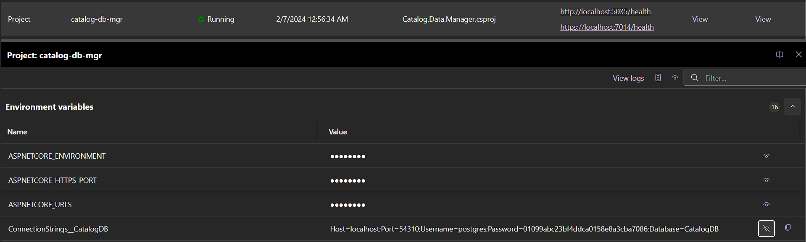

    This environment variable will automatically override the value specified in the project's **appsettings.Development.json** file as configuration values provided from environment variables have higher precedence than those from **appsettings.json** files by default.
1. Locate the pgAdmin resource in the dashboard and click on the hyperlink displayed for it in the **Endpoints** column. Note that the PostgreSQL server defined via the AppHost project was automatically registered with pgAdmin in the **Aspire instances** node:

    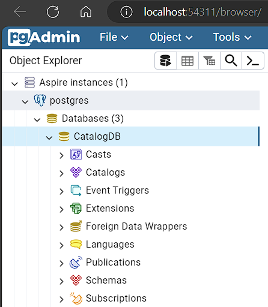

1. Back on the dashboard, click on the **Traces** item from the left-side menu, then find the trace entry with the name **catalog-db-mgr: Migration operation CatalogDbContext** and click on the **View** link in the **Details** column to open the trace view. Note all the spans displayed that represent calls from the application to the database during the database initialization. You might even see the first span errored as the database container was not yet available as the startup order of the different resources are not coordinated:

    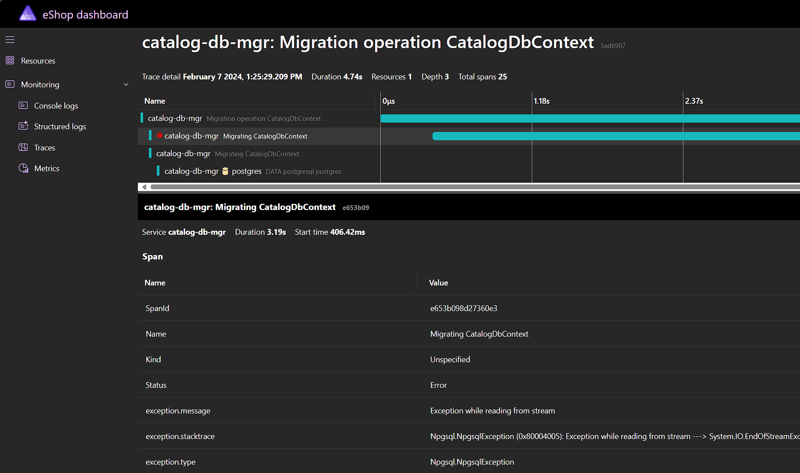

## Create the Catalog API project

Now that we've setup the solution to use Aspire for composing our distributed application, let's add an HTTP API that provides the catalog details stored in the database.

1. Add a new project to the solution using the **ASP.NET Core Web API** project template and call it `Catalog.API`, and ensure the following options are configured:
    - Framework: **.NET 8.0 (Long Term Support)**
    - Authentication Type: **None**
    - Configure for HTTPS: **disabled**
    - Enable container support: **disabled**
    - Enable OpenAPI support: **enabled**
    - Do not use top-level statements: **disabled**
    - Use controllers: **disabled**
    - Enlist in .NET Aspire orchestration: **enabled**

    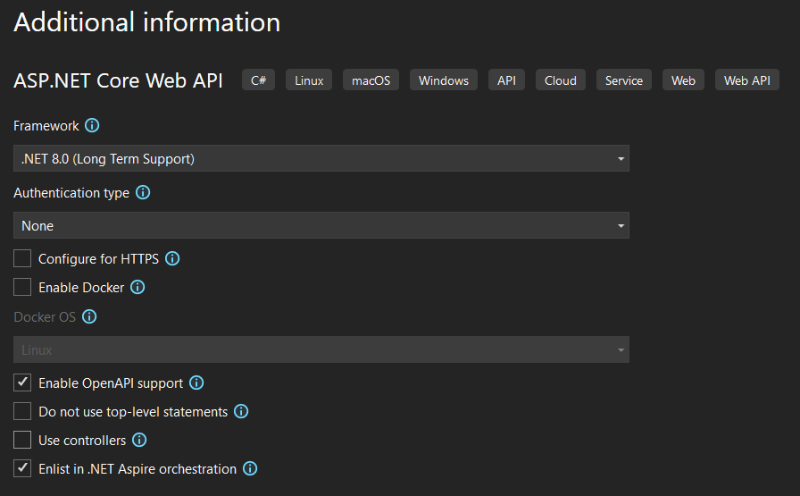

1. In the newly created project, update the package reference to `Swashbuckle.AspNetCore` to version `6.5.0`
1. Open the `Program.cs` file of the `eShop.AppHost` project, and update it so the API project you just added is named `"catalog-api"` and has a reference to the `CatalogDB`:

    ```csharp
    var builder = DistributedApplication.CreateBuilder(args);

    var postgres = builder.AddPostgres("postgres")
                          .WithPgAdmin();
    var catalogDb = postgres.AddDatabase("CatalogDB");

    builder.AddProject<Projects.Catalog_Data_Manager>("catalog-db-mgr")
        .WithReference(catalogDb);

    builder.AddProject<Projects.Catalog_API>("catalog-api")
        .WithReference(catalogDb);

    builder.Build().Run();
    ```

1. Add a project reference from the `Catalog.API` project to the `Catalog.Data` project so that it can use Entity Framework Core to access the database.
1. Open the `Program.cs` file of the `Catalog.API` project and delete the sample code that defines the weather forecasts API. This is all the code beginning with `var summaries = new[]` until the end of the file, with the exception of the `app.Run()` line.
1. Immediately after the line that calls `builder.AddServiceDefaults()`, add a line to configure the `CatalogDbContext` in the application's DI container using the [**Npgsql Entity Framework Core Provider**](https://www.npgsql.org/efcore/index.html) for PostgreSQL. Ensure that the name passed to the method matches the name defined for the database in the AppHost project's `Program.cs` file (`"CatalogDB"`). The `AddNpgsqlDbContext` method comes from the [`Aspire.Npgsql.EntityFrameworkCore.PostgreSQL` Aspire component](https://learn.microsoft.com/dotnet/aspire/database/postgresql-entity-framework-component):

    ```csharp
    builder.AddServiceDefaults();

    builder.AddNpgsqlDbContext<CatalogDbContext>("CatalogDB");
    ```

1. Create a new file called `CatalogApi.cs` and define a static class inside of it called `CatalogApi` in the `Microsoft.AspNetCore.Builder` namespace:

    ```csharp
    namespace Microsoft.AspNetCore.Builder;

    public static class CatalogApi
    {

    }
    ```

1. In this class, add an extension method named `MapCatalogApi` on the `IEndpointRouteBuilder` type, returning that same type:

    ```csharp
    public static IEndpointRouteBuilder MapCatalogApi(this IEndpointRouteBuilder app)
    {
        
        return app;
    }
    ```

    This method will define the endpoint routes for the Catalog API.

1. In the method, add a call to `app.MapGet` to define an endpoint that responds to GET requests to the `/items` path, and is handled by an async lambda that accepts two parameters: a `PaginationRequest` type that will represent the shape of the request, and the `CatalogDbContext` instance that will come from the DI container:

    ```csharp
    app.MapGet("/items", async ([AsParameters] PaginationRequest paginationRequest, CatalogDbContext db) =>
    {

    });
    ```

1. Create a new file called `PaginationRequest.cs` in a new directory in the project called `Model` and in it define a struct type `PaginationRequest` with two integer properties, `PageSize` and `PageIndex`. This type will represent the optional request parameters that can be passed to the `/items` endpoint:

    ```csharp
    namespace eShop.Catalog.API.Model;

    public readonly struct PaginationRequest(int pageSize = 10, int pageIndex = 0)
    {
        public readonly int PageSize { get; } = pageSize;

        public readonly int PageIndex { get; } = pageIndex;
    }
    ```

1. Create another file called `PaginatedItems.cs` in the `Model` directory and in it define a type `PaginatedItems<TItem>` with properties `PageIndex`, `PageSize`, `Count`, and `Data`. This type will represent the shape of the response that will be returned from the `/items` endpoint:

    ```csharp
    namespace eShop.Catalog.API.Model;

    public class PaginatedItems<TItem>(int pageIndex, int pageSize, long count, IEnumerable<TItem> data)
        where TItem : class
    {
        public int PageIndex { get; } = pageIndex;

        public int PageSize { get; } = pageSize;

        public long Count { get; } = count;

        public IEnumerable<TItem> Data { get;} = data;
    }
    ```

1. Back in the `CatalogApi.cs` file, implement the lambda body for the `/items` endpoint so that the appropriate page of catalog items is retrieved from the database and returned in the response. Objects returned from the lambda will be automatically JSON serialized. The `CatalogApi.cs` file should now look something like this:

    ```csharp
    using eShop.Catalog.API.Model;
    using eShop.Catalog.Data;
    using Microsoft.EntityFrameworkCore;

    namespace Microsoft.AspNetCore.Builder;

    public static class CatalogApi
    {
        public static IEndpointRouteBuilder MapCatalogApi(this IEndpointRouteBuilder app)
        {
            app.MapGet("/items", async ([AsParameters] PaginationRequest paginationRequest, CatalogDbContext db) =>
            {
                var pageSize = paginationRequest.PageSize;
                var pageIndex = paginationRequest.PageIndex;

                var totalItems = await db.CatalogItems
                    .LongCountAsync();

                var itemsOnPage = await db.CatalogItems
                    .OrderBy(c => c.Name)
                    .Skip(pageSize * pageIndex)
                    .Take(pageSize)
                    .AsNoTracking()
                    .ToListAsync();

                return new PaginatedItems<CatalogItem>(pageIndex, pageSize, totalItems, itemsOnPage);
            });

            return app;
        }
    }
    ```

1. Go back to the `Program.cs` file of the `Catalog.API` project and add a call to the completed `MapCatalogApi` method, just before the call to `app.Run()`:

    ```csharp
    app.MapCatalogApi();

    app.Run();
    ```

1. Ensure the solution builds successfully before continuing.
1. Launch the AppHost project and click the hyperlink in the dashboard for the `catalog-api` resource's endpoint. This will open a new browser tab displaying the Swagger UI for the Catalog API.

    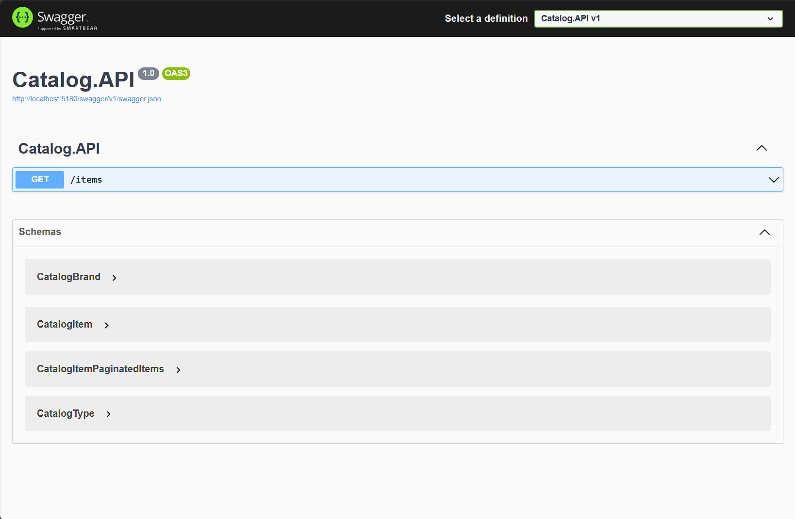
1. Expand the API definition for the `/items` endpoint and click the **Try it out** button, followed by the **Execute** button. You should see the catalog items returned as JSON in the **Response body** section:

    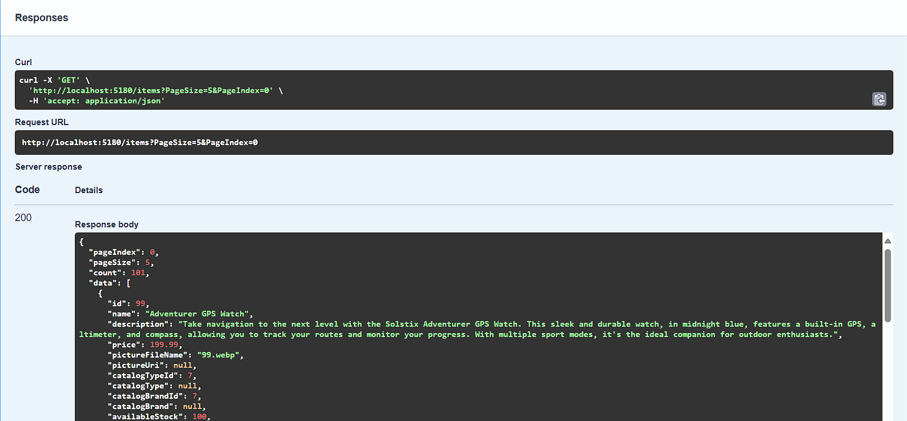

1. As an alternative to the Swagger UI, open the `Catalog.API.http` file in the `Catalog.API` project. This file was added by default when the project was created.
1. Edit the line defining a **GET** request to the `/weatherforecasts` endpoint so that it instead hits the `/items` endpoint:

    ```http
    @Catalog.API_HostAddress = http://localhost:5180

    GET {{Catalog.API_HostAddress}}/items/
    Accept: application/json

    ###
    ```
1. Click the **Send request** link displayed above it to send the request and have the response displayed:

    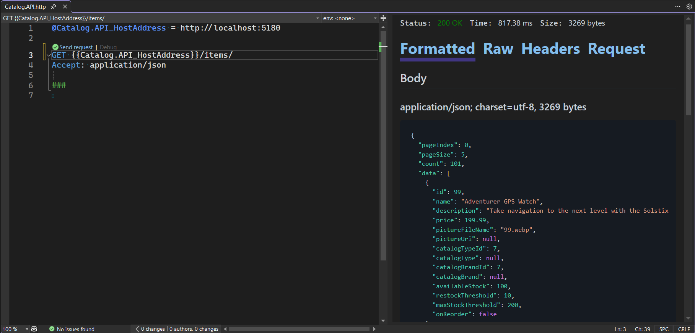
1. [Learn more about .http files in Visual Studio](https://learn.microsoft.com/aspnet/core/test/http-files).
