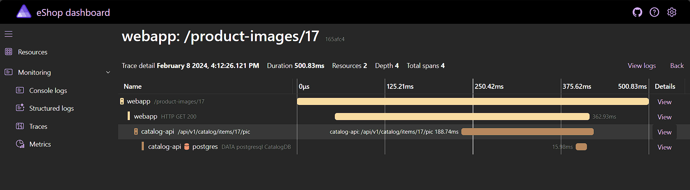
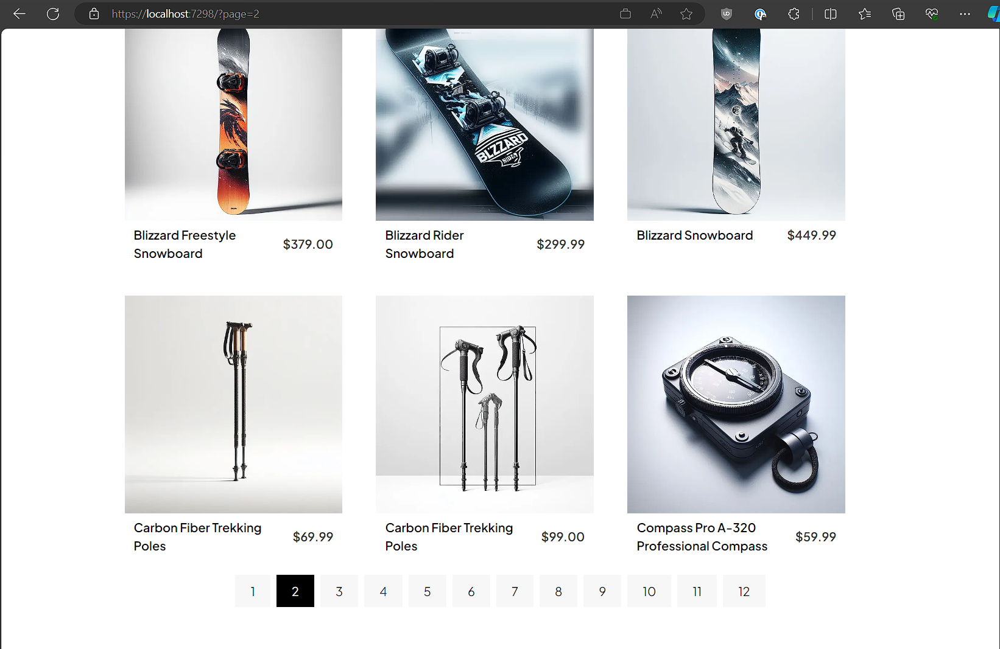
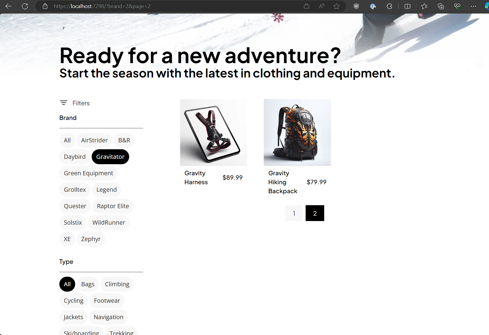
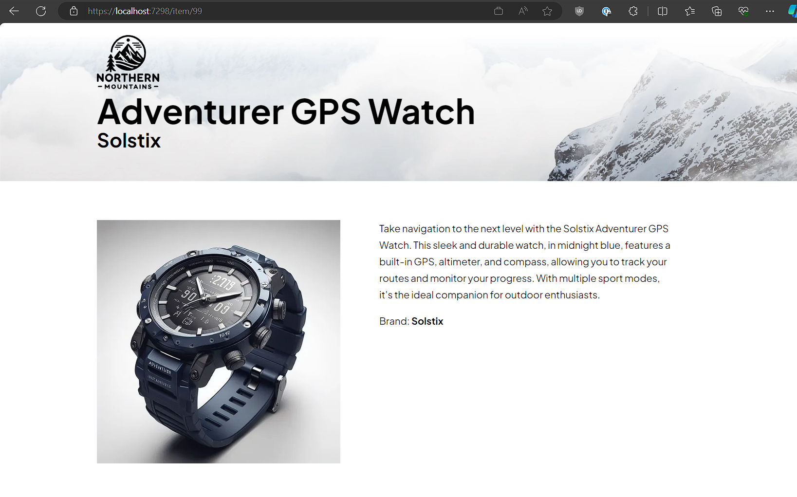

# Create a Blazor-based frontend web shop

Now that we have an API to provide catalog items, we can start the process of building a frontend web shop that customers can use to browse the catalog. We'll use Blazor to create this web app.

## Review the changes to the eShop solution

The provided starting point for this lab is based on the work you completed in the previous lab, however the Catalog API has been extended with more endpoints and the code refactored for better organization.

1. Open the `eShop.lab2.sln` in Visual Studio or VS Code.
1. Note there are some changes to the `Catalog.API` project:
    - The `Apis` directory contains the `CatalogApi.cs` file now, rather than it being in the project root
    - There is an `Extension` directory containing a `HostingExtensions.cs` file, in which an extension method is defined called `AddApplicationServices`. This method is called from the `Program.cs` file to setup the application's services. If any other extension methods are required, they can be placed in classes defined in this directory.
    - There is a `Pics` directory containing product photos for the items in the catalog.
    - There is a `CatalogOptions` class defined in `CatalogOptions.cs` file in the project root. This class is used to support configurable values used in the project.
    - The `Apis/CatalogApi.cs` file now defines many other endpoints for the Catalog API which will be used to support the frontend experience. Take a moment to read the additional endpoint definitions and implementations.
1. The `eShop.ServiceDefaults` project has some changes too, including more extension methods to help with reading required configuration values, and configuring OpenAPI documents from the configuration. Take a moment to read the contents of the new files.
1. Launch the AppHost project and navigate to the Swagger UI for the Catalog API to see the additional endpoints that are now available.

## Add the WebApp project to the AppHost project

The provided starting point for this lab includes a Blazor web project for the frontend of our eShop that we're going to make updates to, but it hasn't yet been composed into the AppHost project.

1. Add a project reference from the `eShop.AppHost` project to the `WebApp` project.
1. Open the `Program.cs` file in the `eShop.AppHost` project and add a line to add the `WebApp` project to the app model, with a reference to the `Catalog.API` project:

    ```csharp
    builder.AddProject<WebApp>("webapp")
        .WithReference(catalogApi);
    ```

1. Run the AppHost project and verify that the `WebApp` project is now included in the list of running resources on the dashboard.
1. Click the first hyperlink for the `WebApp` project in the **Endpoints** column and verify you see the home page of the eShop website.

    

## Create a client service for the Catalog API

To communicate with the Catalog API from the web app, we'll create a service class that uses an `HttpClient` instance managed by the [`IHttpClientFactory` features](https://learn.microsoft.com/dotnet/core/extensions/httpclient-factory).

1. In the `WebApp` project, open the `Services` directory and inside it create a new file `CatalogService.cs`
1. Declare a class in this file called `CatalogService` with a primary constructor that accepts a single `HttpClient httpClient` parameter, and a field to store the common base path of the Catalog API endpoints `"api/v1/catalog"`:

    ```csharp
    namespace eShop.WebApp.Services;

    public class CatalogService(HttpClient httpClient)
    {
        private readonly string remoteServiceBaseUrl = "api/v1/catalog/";


    }
    ```

1. We need a method that will be called to retrieve a page of catalog items from the API. Add an async method called `GetCatalogItems` that accepts appropriate parameters for the page size, page index, and optional item brand and item type filters, and returns `CatalogResult` (this type is already defined in the project), e.g.:

    ```csharp
    public async Task<CatalogResult> GetCatalogItems(int pageIndex, int pageSize, int? brand, int? type)
    {
        
    }
    ```

1. The Catalog API represents the catalog items in the URL space categorized optionally by brand and type, e.g. `/items`, `/items/type/all`, `/items/type/123/brand/456`, etc. Additionally the paging parameters are passed via the query string. This means the URL called by our service needs to be dynamically constructed based on the values of the parameters passed to this method. Create a new method to handle this job called `GetCatalogItemsUri`, e.g.:

    ```csharp
    private static string GetAllCatalogItemsUri(string baseUri, int pageIndex, int pageSize, int? brand, int? type)
    {
        // Build URLs like:
        //   [base]/items
        //   [base]/items/type/all
        //   [base]/items/type/123/brand/456
        //   [base]/items/type/123/brand/456?pageSize=9&pageIndex=2
        string filterPath;

        if (type.HasValue)
        {
            var brandPath = brand.HasValue ? brand.Value.ToString() : string.Empty;
            filterPath = $"/type/{type.Value}/brand/{brandPath}";

        }
        else if (brand.HasValue)
        {
            var brandPath = brand.HasValue ? brand.Value.ToString() : string.Empty;
            filterPath = $"/type/all/brand/{brandPath}";
        }
        else
        {
            filterPath = string.Empty;
        }

        return $"{baseUri}items{filterPath}?pageIndex={pageIndex}&pageSize={pageSize}";
    }
    ```

1. Using this method, update the body of the `GetCatalogItems` method to retrieve the items from the Catalog API using the `httpClient` constructor parameter:

    ```csharp
    public async Task<CatalogResult> GetCatalogItems(int pageIndex, int pageSize, int? brand, int? type)
    {
        var uri = GetAllCatalogItemsUri(remoteServiceBaseUrl, pageIndex, pageSize, brand, type);
        var result = await httpClient.GetFromJsonAsync<CatalogResult>(uri);
        return result ?? new(0, 0, 0, []);
    }
    ```

1. Register the `CatalogService` with the application's DI container and configure its base address to point at the `catalog-api` resource by adding a line to the `Extensions/HostingExtensions.cs` file. Be sure that the host name set in the URI  `BaseAddress`:

    ```csharp
    // HTTP and gRPC client registrations
    builder.Services.AddHttpClient<CatalogService>(o => o.BaseAddress = new("http://catalog-api"));
    ```

1. Ensure the `WebApp` project builds successfully before continuing.

## Update the home page to display catalog items

Now that we have a service we can use to easily retrieve the catalog items from the Catalog API, let's update the site's home page to use the service and display some catalog items.

1. In the `WebApp` project, open the `Components/Pages/Catalog.razor` file. Note that this page is configured to be the home page (served from the `/` path) via the `@page "/"` directive at the top of the file.
1. In order to get an instance of the `CatalogService` class in the `Catalog.razor` file from the application's DI container, add a line using the [`@inject` directive](https://learn.microsoft.com/aspnet/core/blazor/fundamentals/dependency-injection#request-a-service-in-a-component) near the top of the file (make sure it's after the `@page` directive). Note that the format of this is a bit like a property or field in C#, where the first part is the type name and the second part the member name (in this case the property name is the same as the type name but you could use any valid property name):

    ```razor
    @inject CatalogService CatalogService
    ```

1. Locate the `@code` block at the bottom of the `Catalog.razor` file. This is where the page's fields, parameters, and methods can be defined. Define a constant value for the page size of `9` (while the API supports different page sizes, the UI we're going to build assumes a fixed page size):

    ```csharp
    const int PageSize = 9;
    ```

1. Razor components (including pages) execute [according to a pre-defined lifecycle](https://learn.microsoft.com/aspnet/core/blazor/components/lifecycle), represented by methods you can override to perform the desired logic needed to implement the component's behavior. Add code to use the injected `CatalogService` instance to load catalog items and store them in a field when the component is initializing. Just pass fixed values for the parameters other than `pageSize` for now:

    ```csharp
    CatalogResult? catalogResult;

    protected override async Task OnInitializedAsync()
    {
        catalogResult = await CatalogService.GetCatalogItems(0, PageSize, null, null);
    }
    ```

1. Back in the markup section of the file, add some HTML and use Razor expressions to display the items in the `catalogResult` field. Note that you'll need to check the value is not `null` first to avoid a compiler error. Use the existing `CatalogListItem` component defined in the project to handle rendering each item inside the `<div class="catalog>` element:

    ```razor
    <div class="catalog">
        @if (catalogResult is not null)
        {
            <div>
                <div class="catalog-items">
                    @foreach (var item in catalogResult.Data)
                    {
                        <CatalogListItem Item="@item" />
                    }
                </div>
            </div>
        }
    </div>
    ```

1. Run the AppHost project and navigate to the eShop front page. You should see catalog items now but their images aren't rendering correctly:

    

1. Open the browser developer tools (<kbd>F12</kbd>) and navigate to the **Network** pane then refresh the page. From the failed requests log we can see the images are trying to be loaded from paths like `/product-images/99`, where `99` is the product ID but the site doesn't have these files or any endpoint configured to serve them. Like the product details, the product images are served by the Catalog API.
1. [YARP](https://microsoft.github.io/reverse-proxy/) is a package for ASP.NET Core applications that provides highly customizable reverse proxying capabilities. We'll use YARP to proxy the product image requests to the frontend site on to the Catalog API. Add a reference to the `Microsoft.Extensions.ServiceDiscovery.Yarp` package, version `8.0.1`. You can use the [`dotnet` CLI](https://learn.microsoft.com/dotnet/core/tools/dotnet-add-package), or Visual Studio NuGet Package Manager, or edit the `WebApp.csproj` directly:

    ```xml
    <PackageReference Include="Microsoft.Extensions.ServiceDiscovery.Yarp" Version="8.1.0" />
    ```

1. To setup the proxying behavior, first add a line to the `AddApplicationServices` method in the `HostingExtensions.cs` file, to add the require services to the application's DI container:

    ```csharp
    builder.Services.AddHttpForwarderWithServiceDiscovery();
    ```

1. To setup the proxying endpoint, add a line in `Program.cs`, just before the call to `app.Run()` at the end of the file, to map a forwarder endpoint from the incoming path to the Catalog API. The first argument is the pattern for the incoming request path, the second argument is the address of the server to forward the request to, and the last argument is the target path on the forwarded server (i.e. the Catalog API):

    ```csharp
    app.MapForwarder("/product-images/{id}", "http://catalog-api", "/api/v1/catalog/items/{id}/pic");
    ```

1. Run the AppHost project again and navigate to the store's front page. This time the product images are loaded correctly:

    

1. Navigate to the **Traces** page of the dashboard and locate a trace row for one of the product image requests, then click on the **View** link in the **Details** column to open the trace details page. Notice the information that is displayed in the waterfall diagram of the various spans that make up the traced operation, including the request from the browser to the `webapp` resource, the forwarded request from `webapp` to `catalog-api` (both the outgoing and incoming spans), and finally the database call by `catalog-api` to the `CatalogDB` PostgreSQL resource. Click on any individual span to see all the details included in the trace. See if you can find the actual SQL query that was executed against the database as part of serving the image:

    

## Improve the user experience while the catalog page is loading

You may have noticed that, when visiting the catalog page, there is a delay before the page is rendered in the browser. This delay is more noticeable when first loading the page after launching the AppHost project, as it takes a bit of time before the various resources involved are fully started. Let's improve this by utilizing the [streaming rendering feature in Blazor](https://learn.microsoft.com/aspnet/core/blazor/components/rendering?view=aspnetcore-8.0#streaming-rendering) to display a loading message while waiting for the catalog items to be returned by the backend service.

1. In the `Catalog.razor` file, update the markup to render a simple "Loading..." message if the `catalogResult` field is `null`, instead of rendering nothing:

    ```razor
    <div class="catalog">
        @if (catalogResult is null)
        {
            <p>Loading...</p>
        }
        else
        {
            <div>
                <div class="catalog-items">
                    @foreach (var item in catalogResult.Data)
                    {
                        <CatalogListItem Item="@item" />
                    }
                </div>
            </div>
        }
    </div>
    ```

    If you try loading the page again at this point, you'll see no change. This is because by default, Blazor doesn't send any response to the browser until the component has completely finished executing, including asynchronous operations started in component lifecycle events, e.g. in the `OnInitializedAsync` method.
1. Add a directive at the top of the page (after the `@page` directive) to add the `StreamRendering` attribute to the page. This will instruct Blazor to stream the response to the browser as asynchronous operations started by the component complete:

    ```razor
    @attribute [StreamRendering]
    ```

1. Load the page again and notice that the loading message is displayed briefly before the catalog items are rendered.
1. Try forcing a longer delay to make the message easier to see when running locally, by adding a call to `await Task.Delay(1000)` before the call to `CatalogService.GetCatalogItems` in the `OnInitializedAsync` method:

    ```csharp
    protected override async Task OnInitializedAsync()
    {
        await Task.Delay(1000);
        catalogResult = await CatalogService.GetCatalogItems(0, PageSize, null, null);
    }
    ```

## Add support for multiple pages of catalog items

The Catalog API supports returning a subset of matching catalog items to allow for building a page-based UI. Let's update the `Catalog.razor` page to display navigating through the paged results.

1. Under the `PageSize` field, declare a new [component parameter](https://learn.microsoft.com/aspnet/core/blazor/components/#component-parameters) to store the current page number being viewed. The value for this will be [bound from the querystring](https://learn.microsoft.com/aspnet/core/blazor/fundamentals/routing#query-strings) of the request URL, e.g. `/?page=2`, by using the `SupplyParameterFromQuery` attribute:

    ```csharp
    [SupplyParameterFromQuery]
    public int? Page { get; set; }
    ```

1. Update the call to `CatalogService.GetCatalogItems` to use the value of the `Page` parameter if it's set (use `GetValueOrDefault` to help with this). Note that the API accepts the page as a zero-based index, but as this page is viewed by humans, we'll want to offset that by `+1` so that the first page is page 1, the second is page 2, and so on:

    ```csharp
    protected override async Task OnInitializedAsync()
    {
        catalogResult = await CatalogService.GetCatalogItems(Page.GetValueOrDefault(1) - 1, PageSize, null, null);
    }
    ```

1. To help with rendering a set of hyperlinks for navigating to other pages, add a method called `GetVisiblePageIndexes` that generates a list of page numbers based on the `CatalogResult` returned from the call to the Catalog API:

    ```csharp
    static IEnumerable<int> GetVisiblePageIndexes(CatalogResult result)
    => Enumerable.Range(1, (int)Math.Ceiling(1.0 * result.Count / PageSize));
    ```

1. Add markup to render the page links by looping over the page indexes returned from the `GetVisiblePageIndexes` method and render a hyperlink using the built-in [`NavLink` component](https://learn.microsoft.com/aspnet/core/blazor/fundamentals/routing#navlink-component). The CSS defined in `Catalog.razor.css` already includes a styles targeting classes `page-links` and `active-page` so use those to style the links. Add this markup just after the closing `</div>` tag of the `catalog-items` div:

    ```razor
    <div class="catalog">
        @if (catalogResult is null)
        {
            <p>Loading...</p>
        }
        else
        {
            <div>
                <div class="catalog-items">
                    @foreach (var item in catalogResult.Data)
                    {
                        <CatalogListItem Item="@item" />
                    }
                </div>
    
                <div class="page-links">
                    @foreach (var pageIndex in GetVisiblePageIndexes(catalogResult))
                    {
                        <NavLink ActiveClass="active-page" Match="@NavLinkMatch.All" href="@Nav.GetUriWithQueryParameter("page", pageIndex == 1 ? null : pageIndex)">@pageIndex</NavLink>
                    }
                </div>
            </div>
        }
    </div>
    ```

1. Reload the home page and navigate through the pages of the catalog using the links rendered under the items. Note that the application must be fully restarted for this to work as the `SupplyParameterFromQuery` attribute is not recognized after a hot reload:

    

## Add filtering ability to the catalog

The final piece of catalog functionality to add is the ability to filter the items by type and/or brand. The Catalog API already has endpoints to facilitate this so we just need to update `CatalogService` to call them and consume that from `Catalog.razor` with some appropriate UI.

1. In the `CatalogService.cs` file, add two new methods to allow retrieving catalog item types and brands from the Catalog API:

    ```csharp
    public async Task<IEnumerable<CatalogBrand>> GetBrands()
    {
        var uri = $"{remoteServiceBaseUrl}catalogBrands";
        var result = await httpClient.GetFromJsonAsync<CatalogBrand[]>(uri);
        return result ?? [];
    }

    public async Task<IEnumerable<CatalogItemType>> GetTypes()
    {
        var uri = $"{remoteServiceBaseUrl}catalogTypes";
        var result = await httpClient.GetFromJsonAsync<CatalogItemType[]>(uri);
        return result ?? [];
    }
    ```

1. In `Catalog.razor`, declare two new component parameters to capture the brand ID and item type ID from the querystring:

    ```csharp
    [SupplyParameterFromQuery(Name = "brand")]
    public int? BrandId { get; set; }

    [SupplyParameterFromQuery(Name = "type")]
    public int? ItemTypeId { get; set; }
    ```

1. Update the `OnInitializedAsync` method to pass in the values from the `BrandId` and `ItemTypeId` parameters, replacing the `null` values being passed before:

    ```csharp
    protected override async Task OnInitializedAsync()
    {
        catalogResult = await CatalogService.GetCatalogItems(
            Page.GetValueOrDefault(1) - 1,
            PageSize,
            BrandId,
            ItemTypeId);
    }
    ```

1. In the markup, add an instance of the `CatalogSearch` component (already defined in this project) immediately after the opening `<div class="catalog">` tag, passing through the values of the `BrandId` and `ItemTypeId` parameters:

    ```razor
    <div class="catalog">
        <CatalogSearch BrandId="@BrandId" ItemTypeId="@ItemTypeId" />
    ```

1. Locate and open the `/Components/Catalog/CatalogSearch.razor` file. Update this file so that it populates the `catalogBrands` and `catalogItemTypes` fields by calling the methods you just added to the `CatalogService` class. Reminder, you'll need to use the `@inject` directive to get an instance of the `CatalogService` before you can update the `OnInitializedAsync` method.

    For an extra challenge, try calling the methods in parallel before awaiting their results (the `Task.WhenAll` method might be helpful here).
1. Reload the home page and see now that the filter UI is displayed on the left-hand side. Click on the various filter options to verify that the catalog UI functions correctly. Notice how the URL changes as you click through the various filter options and paging links.

    

## Challenge: Update the item details page

If you have time and would like a challenge, try using what you've learned so far and update the `Item.razor` page to display an item's details. This page is linked to from each item on the catalog page.



Hints:

- The Catalog API provides an endpoint at `/items/{id}` to retrieve an item's details via a `GET` request.
- You can get image URLs for items from the `IProductImageUrlProvider` service which is already registered in the application's DI container (`@inject`...).
- The `Item.razor.css` file already defines some styles targeting class names like `item-details` and `description` that should help with styling the content.
- Think about what should happen if the item ID in the querystring doesn't have a matching catalog item. Displaying a "not found" message and changing the HTTP response status code to `404` might be things to consider.
