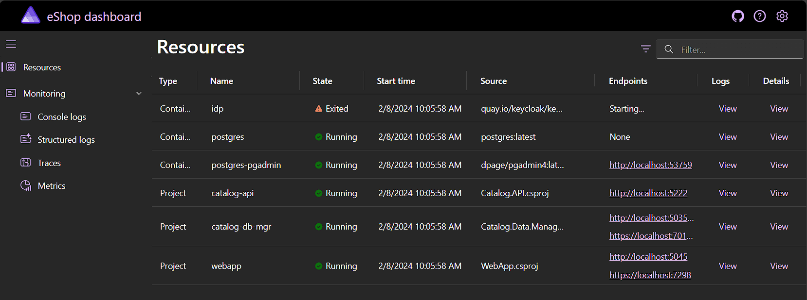
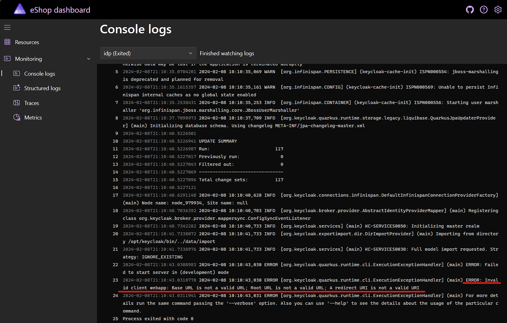
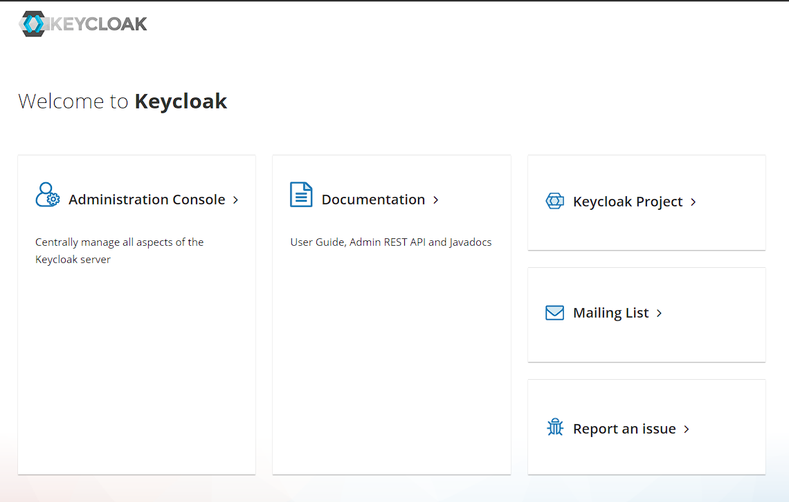
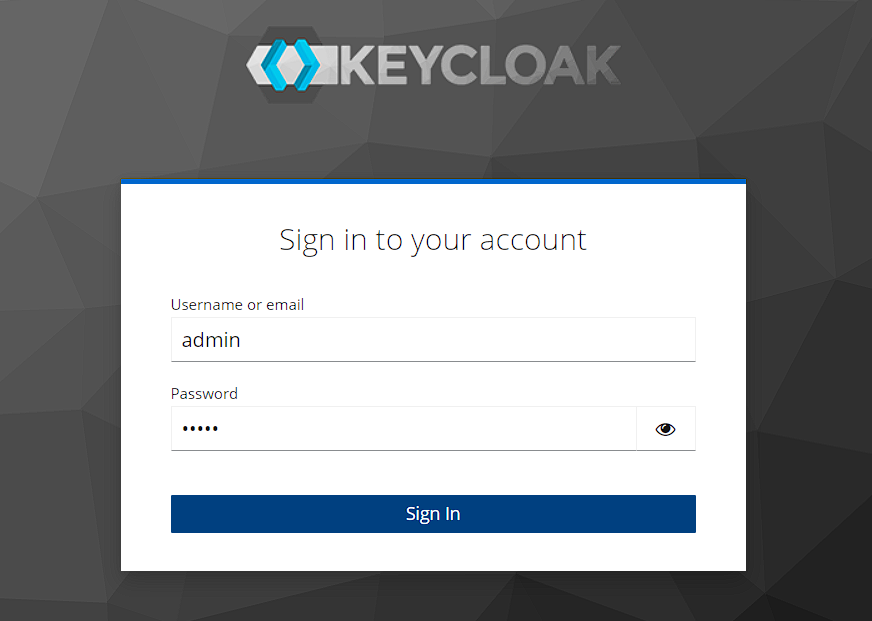
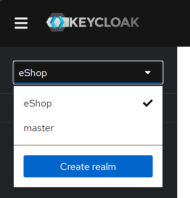
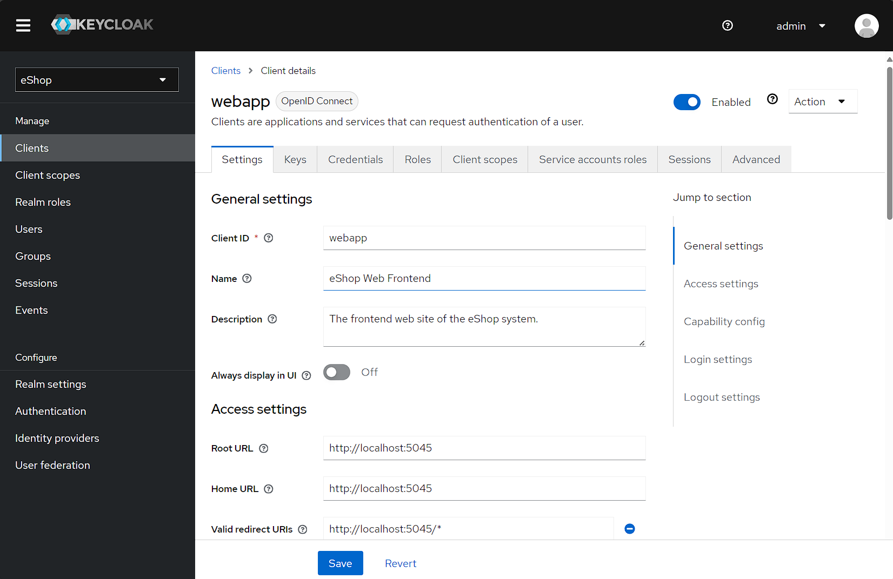
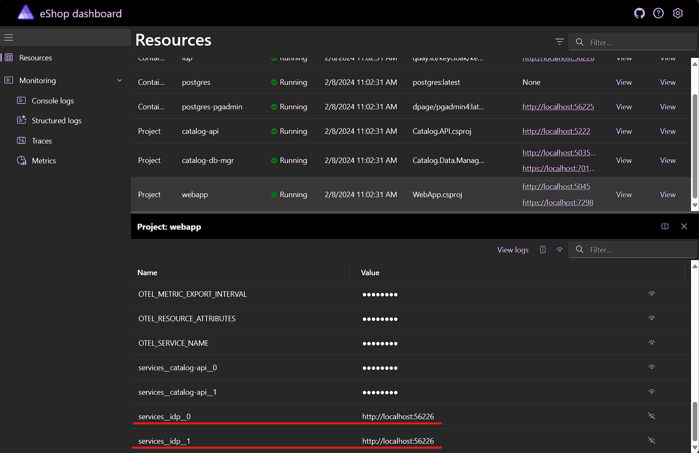
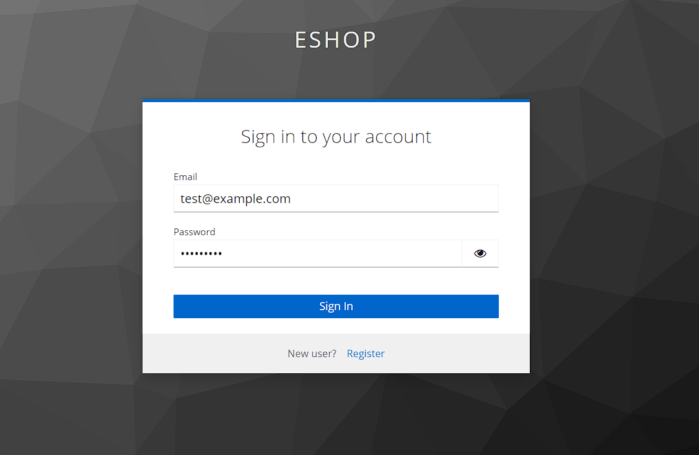
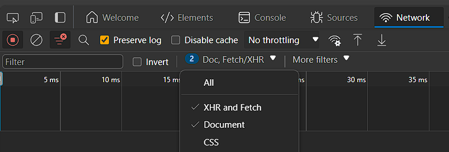
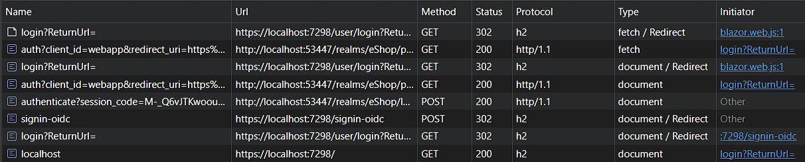

# Add an identity provider (IdP) and authentication

Before we can start adding traditional shopping capabilities to our web store, like adding items to a shopping basket and checking out to create an order, we need to allow shoppers to register as users on the site. Given that we're building a distributed system comprised of multiple services that will need to operate in the context of the currently logged-in user and facilitate appropriate access control, we'll use a separate dedicated identity provider (IdP) to handle user registration and access control. The individual services in our distributed application will integrate with the IdP using standard authentication and authorization protocols such as [OpenID Connect](https://openid.net/developers/discover-openid-and-openid-connect/).

There are many options available for implementing an IdP, including:

- Hosted services on cloud providers like [Microsoft Entra ID](https://www.microsoft.com/security/business/identity-access/microsoft-entra-id) and [AWS Identity Services](https://aws.amazon.com/identity/).
- Dedicated commercial hosted identity service providers like [Auth0](https://auth0.com/).
- Commercial .NET-based identity service products for on-premises hosting like [Duende IdentityServer](https://duendesoftware.com/products/identityserver).
- Free open-source .NET libraries for building and hosting your own identity service like [OpenIddict](https://documentation.openiddict.com/).
- Free open-source "IdP in a box" solutions that are easy to start with and customizable with plug-ins and code like [Keycloak](https://www.keycloak.org/).

[Keycloak](https://www.keycloak.org/) is available as a configurable container image that makes it very easy to get started with and is supported by a rich community ecosystem. We'll use it to create an IdP for our distributed application.

You can read more about [selecting an identity management solution for ASP.NET Core applications here](https://learn.microsoft.com/aspnet/core/security/how-to-choose-identity-solution?view=aspnetcore-8.0).

## Compose a Keycloak instance into the AppHost project via a custom resource type

.NET Aspire includes built-in support for a number of different container-based resources, but is also easy to extend with custom resources that encapsulate useful behavior.

1. The starting point for this lab includes code for a custom Aspire resource for Keycloak in the `KeycloakResource.cs` file of the `eShop.AppHost` project. Open this file and read through the code to get an understanding of how this custom resource builds upon the primitives provided by `Aspire.Hosting`.
1. Open the `Program.cs` file in the `eShop.AppHost` and add code to compose a Keycloak instance named `"idp"` into the app model and import the realm data JSON files in the `../Keycloak/data/import/` directory:

    ```csharp
    // Identity Providers

    var idp = builder.AddKeycloakContainer("idp", tag: "23.0")
        .ImportRealms("../Keycloak/data/import");
    ```

    By default, the Keycloak container added will use the tag `latest` but to protect ourselves against breaking changes in new versions, we specify a specific version tag of `23.0` here.

1. Run the AppHost project and notice that after a few moments the dashboard shows the status of the `idp` resource as "Exited" with a warning triangle icon. Click the **View** link in the **Logs** column of the row for the `idp` resource to read the logs for an indication of what the problem is:

    

    

    The logs should indicate that there was an error with the imported client `webapp`, specifically that the URLs/URIs configured are invalid. This is because the `eshop-realm.json` file that was imported contains processing tokens intended to inject values from environment variables which haven't been configured yet.
1. We can use Aspire APIs to extract the runtime-assigned URLs for our `webapp` resource and inject them into the `idp` resource as environment variables using the [`WithEnvironment` method](https://learn.microsoft.com/dotnet/api/aspire.hosting.resourcebuilderextensions.withenvironment?view=dotnet-aspire-8.0), so that the processing tokens in the imported `eshop-realm.json` file will be replaced with valid values. Add the following lines to the `Program.cs` file, after the call defining the `webapp` resource. You will need to modify the `webapp` resource code to capture the resource in a variable named `webApp`:

    ```csharp
    
    var webApp = builder.AddProject<WebApp>("webapp")
        .WithReference(catalogApi)
        .WithReference(idp, env: "Identity__ClientSecret");

    // Inject the project URLs for Keycloak realm configuration
    var webAppHttp = webApp.GetEndpoint("http");
    var webAppHttps = webApp.GetEndpoint("https");
    idp.WithEnvironment("WEBAPP_HTTP_CONTAINERHOST", webAppHttp);
    idp.WithEnvironment("WEBAPP_HTTP", () => $"{webAppHttp.Scheme}://{webAppHttp.Host}:{webAppHttp.Port}");
    if (webAppHttps.Exists)
    {
        idp.WithEnvironment("WEBAPP_HTTPS_CONTAINERHOST", webAppHttps);
        idp.WithEnvironment("WEBAPP_HTTPS", () => $"{webAppHttps.Scheme}://{webAppHttps.Host}:{webAppHttps.Port}");
    }
    else
    {
        // Still need to set these environment variables so the KeyCloak realm import doesn't fail
        idp.WithEnvironment("WEBAPP_HTTPS_CONTAINERHOST", webAppHttp);
        idp.WithEnvironment("WEBAPP_HTTPS", () => $"{webAppHttp.Scheme}://{webAppHttp.Host}:{webAppHttp.Port}");
    }
    ```

1. Run the AppHost project again and verify that the container starts successfully. This can be confirmed by finding the following lines in the container's logs:

    ```log
    INFO  [org.keycloak.exportimport.dir.DirImportProvider] (main) Importing from directory /opt/keycloak/bin/../data/import
    INFO  [org.keycloak.services] (main) KC-SERVICES0030: Full model import requested. Strategy: IGNORE_EXISTING
    INFO  [org.keycloak.exportimport.util.ImportUtils] (main) Realm 'eShop' imported
    INFO  [org.keycloak.services] (main) KC-SERVICES0032: Import finished successfully
    ```

1. Go back to the dashboard **Resources** page and click on the link for the `idp` resource in the **Endpoints** column to launch the Keycloak instance's homepage, then click on the **Administration Console** link:

    

1. Sign in to the administration console using the following credentials:
    - Username: **admin**
    - Password: **admin**

    

1. Once signed in, select the **eShop** realm from the drop-down in the top-left corner:

    

1. Visit the **Clients** and **Users** pages of the administration console and see that the realm is already configured with a client app named **webapp** and a user named **test@example.com**. Note that the **Home URL** for the **webapp** client matches the endpoint URL of our `WebApp` project as that value was injected by the code we added to the `eShop.AppHost` project:

    

1. Now that we've confirmed that our Keycloak instance is successfully configured, update the `Program.cs` file of the AppHost project so that the `webapp` resource references the `idp` Keycloak resource, using the `WithReference` method. This will ensure that the `webapp` resource will have configuration values injected via its environment variables so that it can resolve calls to `http://idp` with the actual address assigned when the project is launched:

    ```csharp
    var webApp = builder.AddProject<WebApp>("webapp")
        .WithReference(catalogApi)
        .WithReference(idp);
    ```

1. Launch the AppHost project again and use the dashboard to verify that the address of the `idp` resource was injected into the `webapp` resource via environment variables:

    

## Wire-up the web site to the IdP to enable user login

Now that our Keycloak instance is setup as an IdP, we can configure the web site to use it for identity and authentication purposes via OpenID Connect.

1. Open the `WebApp` project and add a reference to the `Microsoft.AspNetCore.Authentication.OpenIdConnect` NuGet package, version `8.0.1`. You can use the `dotnet` CLI, Visual Studio NuGet Package Manager, or just edit the .csproj file manually:

    ```xml
    <PackageReference Include="Microsoft.AspNetCore.Authentication.OpenIdConnect" Version="8.0.7" />
    ```

1. In the `WebApp` project, open the `HostingExtensions.cs` file and add a new field to define a name for the `HttpClient` instance the OIDC code will use:

    ```csharp
    public const string OpenIdConnectBackchannel = "OpenIdConnectBackchannel";
    ```

1. In the `AddApplicationServices` method, add a line at the end to add and configure the `HttpClient` that will be used by the OIDC authentication handler. Note that the host name in the configured URL matches the resource name of our Keycloak instance from the `eShop.AppHost` project. The [service discovery system](https://learn.microsoft.com/dotnet/core/extensions/service-discovery) will use the configuration values injected by the AppHost project into the web site's environment variables to resolve this name to an actual address at runtime:

    ```csharp
    builder.Services.AddHttpClient(OpenIdConnectBackchannel, o => o.BaseAddress = new("http://idp"));
    ```

1. In the same file, add the following methods that will configure authentication and authorization services in the application's DI container, and configure the OIDC authentication handler to use our IdP (remember to add any required `using` statements to import the `System.Security.Claims` namespace):

    ```csharp
    public static void AddAuthenticationServices(this IHostApplicationBuilder builder)
    {
        var configuration = builder.Configuration;
        var services = builder.Services;

        var sessionCookieLifetime = configuration.GetValue("SessionCookieLifetimeMinutes", 60);

        // Add Authentication services
        services.AddAuthorization();
        services.AddAuthentication(options =>
        {
            options.DefaultScheme = CookieAuthenticationDefaults.AuthenticationScheme;
            options.DefaultChallengeScheme = OpenIdConnectDefaults.AuthenticationScheme;
        })
            .AddCookie(options => options.ExpireTimeSpan = TimeSpan.FromMinutes(sessionCookieLifetime))
            .AddOpenIdConnect()
            .ConfigureWebAppOpenIdConnect();

        // Blazor auth services
        services.AddScoped<AuthenticationStateProvider, ServerAuthenticationStateProvider>();
        services.AddCascadingAuthenticationState();
    }

    private static void ConfigureWebAppOpenIdConnect(this AuthenticationBuilder authentication)
    {
        // Named options
        authentication.Services.AddOptions<OpenIdConnectOptions>(OpenIdConnectDefaults.AuthenticationScheme)
            .Configure<IConfiguration, IHttpClientFactory, IHostEnvironment>(configure);

        // Unnamed options
        authentication.Services.AddOptions<OpenIdConnectOptions>()
            .Configure<IConfiguration, IHttpClientFactory, IHostEnvironment>(configure);

        static void configure(OpenIdConnectOptions options, IConfiguration configuration, IHttpClientFactory httpClientFactory, IHostEnvironment hostEnvironment)
        {
            var clientSecret = configuration.GetRequiredSection("Identity").GetRequiredValue("ClientSecret");
            var backchannelHttpClient = httpClientFactory.CreateClient(OpenIdConnectBackchannel);

            options.Backchannel = backchannelHttpClient;
            options.Authority = backchannelHttpClient.GetIdpAuthorityUri(configuration).ToString();
            options.ClientId = "webapp";
            options.ClientSecret = clientSecret;
            options.ResponseType = OpenIdConnectResponseType.Code;
            options.SaveTokens = true; // Preserve the access token so it can be used to call backend APIs
            options.RequireHttpsMetadata = !hostEnvironment.IsDevelopment();
            options.MapInboundClaims = false; // Prevent from mapping "sub" claim to nameidentifier.
        }
    }

    public static async Task<string?> GetBuyerIdAsync(this AuthenticationStateProvider authenticationStateProvider)
    {
        var authState = await authenticationStateProvider.GetAuthenticationStateAsync();
        var user = authState.User;
        return user.GetUserId();
    }

    public static async Task<string?> GetUserNameAsync(this AuthenticationStateProvider authenticationStateProvider)
    {
        var authState = await authenticationStateProvider.GetAuthenticationStateAsync();
        var user = authState.User;
        return user.GetUserName();
    }
    ```

1. Spend a few minutes reading through the added methods, including navigating to the definition of methods like `GetIdpAuthorityUri` which is defined in the `eShop.ServiceDefaults` project and shows how the OIDC authority URL is constructed from the `HttpClient.BaseAddress` and custom configuration values. Note that this address format is specific to our Keycloak instance and using other IdPs would require modified logic.

    Notice that there are actually two authentication schemes being configured:

    - Cookies
    - OpenID Connect

    This is common when implementing federated authentication. Rather than requiring every single request to a protected resource to be first authenticated and verified by the IdP, the user signs in via the IdP, before the application then creates an authentication cookie that is valid for a configurable period of time. The cookie will be the user's authentication credentials until such time that they sign out or the cookie expires, or some other policy configured by the application requires the user to be verified with the IdP again.

    Authentication and authorization can be complicated topics with many moving pieces and required configuration due to the inherent complexities and flexibilities of the related standards and implementing services. To learn more [visit the documentation](https://learn.microsoft.com/aspnet/core/security/authentication/).
1. In the `AddApplicationServices` method, add a line at the beginning to call the `AddAuthenticationServices` method you added in the previous steps:

    ```csharp
    builder.AddAuthenticationServices();
    ```

1. Open the `Services/LogOutService.cs` file. This file defines a class that will be used to sign a user out when requested or required. Update the `LogOutAsync` method to sign the user out of both configured authentication schemes (cookies and OIDC):

    ```csharp
    public async Task LogOutAsync(HttpContext httpContext)
    {
        await httpContext.SignOutAsync(CookieAuthenticationDefaults.AuthenticationScheme);
        await httpContext.SignOutAsync(OpenIdConnectDefaults.AuthenticationScheme);
    }
    ```

    At this point, all the code required to configure authentication in the app has been added. Now we'll enable UI elements to allow the user to sign in.
1. The project already contains a Razor Component that defines a menu for users including sign in and sign out options. Locate and open the `Layout/UserMenu.razor` file and take a moment to read through it, noting the use of the `AuthorizeView` component to display different UI elements depending on whether the user is currently authorized or not.
1. The project also already contains Razor Component pages for signing in and signing out. Open the `User/LogIn.razor` file and note that there is no UI markup defined here. That's because we're using an IdP and federated authentication so the sign in UI will be owned by the IdP which the application will redirect the user to when they need to sign in. The redirect is automatically instigated by the ASP.NET Core authentication system when this page is navigated to, due to this page being decorated with the `[Authorize]` attribute.

    There's a helper method defined on this page to construct a URL that can be used to navigate to the page to perform a sign in, with support for various scenarios including redirecting to the original page the user requested that required them to sign in (`ReturnUrl`), preserving the original querystring or not, and forcing the user to re-login for relevant scenarios (we'll explore some of those in a later lab).
1. Open the `Layout/HeaderBar.razor` file and uncomment the line that adds the `UserMenu` component to the header navigation bar:

    ```razor
    <UserMenu />
    ```

1. Launch the AppHost project and navigate to the home page of the web site. There should now be a user menu icon displayed in the top right-hand corner of the page:

    

1. Clicking the icon will redirect you to the sign-in form hosted by the IdP. You can sign in using the following credentials:
    - Email: **test@example.com**
    - Password: **P@$$w0rd1**

    

1. Upon successfully signing in, you should be redirected back to the web site home page. Hover over the user menu icon now and see that a **Log out** menu option is presented, indicating that you are now signed in:

    

1. Click the **Log out** menu item and confirm that you are signed out of the web site.
1. Open the browser developer tools (<kbd>F12</kbd>) and select the **Network** tab. Ensure the **Preserve log** checkbox is selected. In the **Request types** filter menu/toolbar, select both **XHR and Fetch** and **Document** options:

    

1. With the **Network** tab open, click on the user icon to instigate the sign-in flow. Enter the credentials and complete the sign-in process. Take a moment to look at the log of network requests that were made by the browser to complete the sign-in flow between the web site and the IdP. Note that you might see some extra entries related to browser extensions and/or dev tools that aren't part of the actual authentication flow:

    

    You can read more about the authentication flow occurring here in the [Keycloak documentation](https://www.keycloak.org/docs/latest/securing_apps/#authorization-code).
