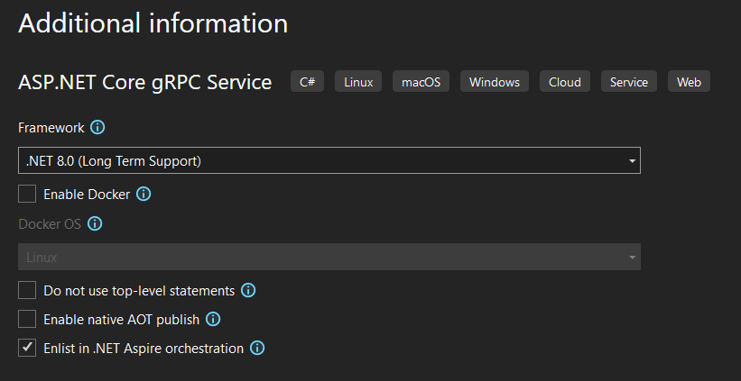
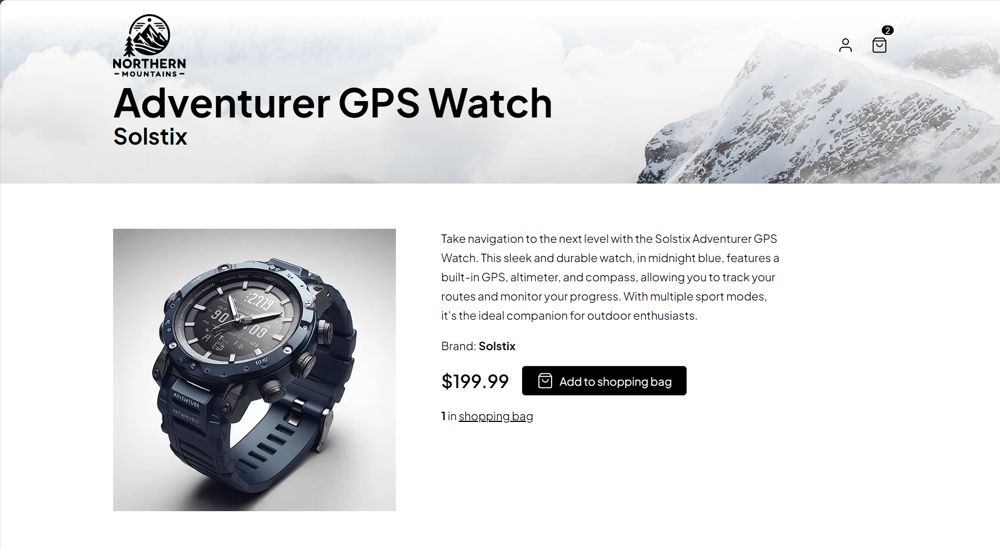
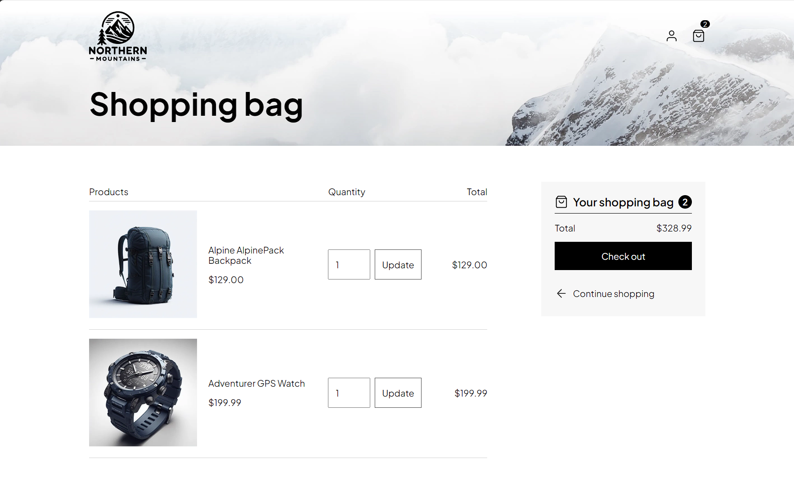

# Add shopping basket capabilities to the web site

In previous labs, we have created a web site that shoppers can use to browser a through pages of products, optionally with filtering by brand or type, and added the ability for users to create an account and sign in. In this lab, we will add the capability to add products to a shopping basket. The shopping basket will be stored in Redis, and exposed via a new gRPC service that the web site will communicate with.

## Add a gRPC service project

### Visual Studio

1. Add a new project called `Basket.API` to the solution using the **ASP.NET Core gRPC Service** template. Ensure that the following template options are configured:

    - Framework: **.NET 8.0 (Long Term Support)**
    - Enable container support: **disabled**
    - Do not use top-level statements: **disabled**
    - Enable native AOT publish: **disabled**
    - Enlist in .NET Aspire orchestration: **enabled**

    

### dotnet CLI

In the .NET CLI, we need to do a few steps manually to configure .NET Aspire orchestration.

1. Run the following commands in the `src` folder to create the `Basket.API` gRPC project.

    ```console
    dotnet new grpc -n Basket.API
    dotnet sln add Basket.API
    ```

1. Add a reference to the `eShop.AppHost` from the `Basket.API` project:

    ```console
    cd eShop.AppHost
    dotnet add reference ..\Basket.API
    ```

1. Add a reference from the `Basket.API` project to the `eShop.ServiceDefaults` project:

    ```console
    cd ..\Basket.API
    dotnet add reference ..\ServiceDefaults
    ```

1. Open the `Program.cs` file in the `AppHost` project and add the following code to create a new resource for the `Basket.API` project:

    ```csharp
    var basketApi = builder.AddProject<Projects.Basket_API>("basket-api");
    ```

1. Open the `Program.cs` file in the `Basket.API` and add a line at the top to add the service defaults:

    ```csharp
    builder.AddServiceDefaults();
    ```

### Additional project configuration

1. Open the `Program.cs` file in the AppHost project and add the following code:

    ```csharp
    var builder = DistributedApplication.CreateBuilder(args);
    
    builder.AddProject<Projects.Catalog_Data_Manager>("catalog-db-mgr");
    
    builder.Build().Run();
    ```

1. Open the `Basket.Api.csproj` file and add a line to the `PropertyGroup` at the top change the default root namespace of the project to `eShop.Basket.API`:

    ```xml
    <RootNamespace>eShop.Basket.API</RootNamespace>
    ```

1. Install the `Aspire.Hosting.Redis` package in the `eShop.AppHost` project using either of the following:

    ```shell
    dotnet add package Aspire.Hosting.Redis
    ```

    ```xml
    <PackageReference Include="Aspire.Hosting.Redis" Version="8.1.0" />
    ```

1. Open the `Program.cs` file in the `eShop.AppHost` project and add a line to create a new Redis resource named `"BasketStore"` and configure it to host a [Redis Commander](https://joeferner.github.io/redis-commander/) instance too (this will make it easier to inspect the Redis database during development). Capture the resource in a `basketStore` variable:

    ```csharp
    var basketStore = builder.AddRedis("BasketStore").WithRedisCommander();
    ```

    Aspire will automatically create containers for both Redis and Redis Commander  when the application is run.

1. Find the line that was added to add the `Basket.API` gRPC project to the AppHost as a resource. Update the code to name the resource `"basket-api"`, make it reference the `idp` and `BasketStore` resources, and capture it in a `basketApi` variable:

    ```csharp
    var basketApi = builder.AddProject<Projects.Basket_API>("basket-api")
        .WithReference(idp)
        .WithReference(basketStore);
    ```

    The `Basket.API` will require calls to be authenticated by the IdP, and will need to access the Redis database to store and retrieve shopping baskets.

1. Update the `webapp` resource to reference the `basket-api` resource so the web site can communicate with the Basket API:

    ```csharp
    
    var webApp = builder.AddProject<Projects.WebApp>("webapp")
        .WithReference(catalogApi)
        .WithReference(basketApi) // <--- Add this line
        .WithReference(idp, env: "Identity__ClientSecret");
    ```

1. Run the AppHost project and verify that the containers for Redis and Redis Commander are created and running by using the dashboard. Also verify that the `Basket.API` project is running and that it's environment variables contain the configuration values to communicate with the IdP and Redis.

## Configure the Basket API to communicate with Redis

1. Following the pattern we've used in our other projects, create a new file `HostingExtensions.cs` in an `Extensions` directory in the `Basket.API` project and add a class to it called `HostingExtensions`. Add a method to the class called `AddApplicationServices`:

    ```csharp
    namespace Microsoft.Extensions.Hosting;

    public static class HostingExtensions
    {
        public static IHostApplicationBuilder AddApplicationServices(this IHostApplicationBuilder builder)
        {

            return builder;
        }
    }

    ```

    We'll add code here later to configure the services in the application's DI container as we build out the Basket API.

1. In the `Program.cs` file, add a call to the `AddApplicationServices` method after the call to `AddServiceDefaults`:

    ```csharp
    builder.AddServiceDefaults();
    builder.AddApplicationServices();
    ```

1. To communicate with Redis we'll use the [Aspire StackExchange Redis component](https://learn.microsoft.com/dotnet/aspire/caching/stackexchange-redis-component). Aspire components are NuGet packages that integrate common client libraries with the Aspire stack, ensuring that they're configured with the application's DI container and setup for observability, reliability, and configurability.

    Add the `Aspire.StackExchange.Redis` component NuGet package to the `Basket.API` project. You can use the **Add > .NET Aspire Compoenent...** project menu item in Visual Studio, the `dotnet add package` command at the command line, or by editing the `Basket.API.csproj` file directly:

    ```xml
    <PackageReference Include="Aspire.StackExchange.Redis" Version="8.1.0" />
    ```

1. In the `AddApplicationServices` method in `HostingExtensions.cs`, add a call to `AddRedis` to configure the Redis client in the application's DI container. Pass the name `"BasketStore"` to the method to indicate that the client should be configured to connect to the Redis resource with that name in the AppHost:

    ```csharp
    public static IHostApplicationBuilder AddApplicationServices(this IHostApplicationBuilder builder)
    {
        builder.AddRedisClient("BasketStore");

        return builder;
    }
    ```

    Now, to use the Redis client in the application, we simply need to accept a constructor parameter of type [`IConnectionMultiplexer`](https://stackexchange.github.io/StackExchange.Redis/Basics)

## Define the gRPC service

1. gRPC services are defined using [Protocol Buffers (protobuf)](https://protobuf.dev/) files. Add a new file called `basket.proto` to the `Protos` directory in the `Basket.API` project. Add the following content to the file:

    ```protobuf
    syntax = "proto3";

    option csharp_namespace = "eShop.Basket.API.Grpc";

    package BasketApi;

    service Basket {
        rpc GetBasket(GetBasketRequest) returns (CustomerBasketResponse) {}
        rpc UpdateBasket(UpdateBasketRequest) returns (CustomerBasketResponse) {}
    }

    message GetBasketRequest {
    }

    message UpdateBasketRequest {
        repeated BasketItem items = 1;
    }

    message BasketItem {
        int32 product_id = 1;
        int32 quantity = 2;
    }

    message CustomerBasketResponse {
        repeated BasketItem items = 1;
    }
    ```

    This file defines a gRPC service called `Basket` with two methods: `GetBasket` and `UpdateBasket`. The `GetBasket` method takes a `GetBasketRequest` message and returns a `CustomerBasketResponse` message with a repeated `BasketItem` field. The `UpdateBasket` method takes an `UpdateBasketRequest` message with a repeated `BasketItem` field and also returns a `CustomerBasketResponse`.

1. Delete the `greeter.proto` file that was included with the template.

1. Update the `Basket.API.csproj` file to add the `basket.proto` file as a `Protobuf` item in the project and set the `GrpcServices` metadata to `"Server"` to indicate that it should be used to generate server-side code for the gRPC service:

    ```xml
    <ItemGroup>
        <Protobuf Include="Protos\basket.proto" GrpcServices="Server" />
    </ItemGroup>
    ```

    The project system will automatically generate code behind the scenes to represent the messages and service defined in the `basket.proto` file. We'll use these generated types in our service implementation.

1. In the `Basket.API` project, create a `Grpc` directory and add a new file to it named `BasketService.cs`. Use the following code to define a class in it named `BasketService` that derives from `Basket.BasketBase`:

    ```csharp
    namespace eShop.Basket.API.Grpc;

    public class BasketService : Basket.BasketBase
    {

    }
    ```

1. In the `Program.cs` file, update the line that maps the `GreeterService` gRPC service so that it maps the `BasketService` instead:

    ```csharp
    app.MapGrpcService<BasketService>();
    ```

1. Delete the `Services/GreeterSrevice.cs` file that was included with the template, including the `Services` directory.

## Implement Redis storage logic

1. In the `Basket.API` project, create a file `RedisBasketStore.cs` in a `Storage` directory and define a class in it named `RedisBasketStore` with a constructor that accepts a single parameter of type `IConnectionMultiplexer`:

    ```csharp
    namespace eShop.Basket.API.Storage;

    public class RedisBasketStore(IConnectionMultiplexer redis)
    {

    }
    ```

    The `RedisBasketStore` class will be responsible for storing and retrieving shopping baskets from the Redis database.

1. Add a field of type `IDatabase` and initialize it by calling `redis.GetDatabase()`:

    ```csharp
    private readonly IDatabase _database = redis.GetDatabase();
    ```

1. Our shopping baskets will be stored in Redis with a key like `/basket/123` where `123` is the user's ID. Define a field of type `RedisKey` named `BasketKeyPrefix` to store the prefix of the key, and a method named `GetBaksetKey` that accepts a `string` parameter `userId` and returns a `RedisKey`:

    ```csharp
    private static readonly RedisKey BasketKeyPrefix = "/basket/";

    private static RedisKey GetBasketKey(string userId) => BasketKeyPrefix.Append(userId);
    ```

1. Before we can add our methods to get and update the basket, we need to define the types that will be used to represent the shopping basket in Redis. Instances of these types will be serialized and deserialized to and from JSON.

    Add a new file `BasketItem.cs` in a `Models` directory and define a class in it named `BasketItem` with properties for the product ID, product name, unit price, and quantity:

    ```csharp
    namespace eShop.Basket.API.Models;

    public class BasketItem
    {
        public int ProductId { get; set; }

        public int Quantity { get; set; }
    }
    ```

    Add another file `CustomerBasket.cs` in the `Models` directory and define a class in it named `CustomerBasket` with properties for the buyer ID and items in the basket:

    ```csharp
    namespace eShop.Basket.API.Models;

    public class CustomerBasket
    {
        public required string BuyerId { get; set; }

        public List<BasketItem> Items { get; set; } = [];
    }
    ```

1. In `RedisBasketStore.cs`, add an async method named `GetBasketAsync` that accepts a parameter for the buyer ID and returns the `CustomerBasket`from Redis if it exists:

    ```csharp
    public async Task<CustomerBasket?> GetBasketAsync(string customerId)
    {
        var key = GetBasketKey(customerId);

        using var data = await _database.StringGetLeaseAsync(key);

        return data is { Length: > 0 }
            ? JsonSerializer.Deserialize<CustomerBasket>(data.Span)
            : null;
    }
    ```

    Now add a method to update the basket:

    ```csharp
    public async Task<CustomerBasket?> UpdateBasketAsync(CustomerBasket basket)
    {
        var json = JsonSerializer.SerializeToUtf8Bytes(basket);
        var key = GetBasketKey(basket.BuyerId);

        var created = await _database.StringSetAsync(key, json);

        return created
            ? await GetBasketAsync(basket.BuyerId)
            : null;
    }
    ```

1. In `HostingExtensions.cs`, add a call in the `AddApplicationServices` method to `AddSingleton` to register the `RedisBasketStore` class in the application's DI container:

    ```csharp
    builder.Services.AddSingleton<RedisBasketStore>();
    ```

    The `RedisBasketStore` class is now ready to be used by our gRPC `BasketService` class.

## Implement the gRPC service to get the basket

1. Back in the `BasketService.cs` file, update the constructor to accept a `RedisBasketStore` parameter. This will be populated from the application's DI container when the service is created:

    ```csharp
    public class BasketService(RedisBasketStore basketStore) : Basket.BasketBase
    {
        
    }
    ```

1. Add methods to convert between our model types (those serialized to JSON by `BasketService` to store in Redis) and our gRPC message types:

    ```csharp
    private static CustomerBasketResponse MapToCustomerBasketResponse(CustomerBasket customerBasket)
    {
        var response = new CustomerBasketResponse();

        foreach (var item in customerBasket.Items)
        {
            response.Items.Add(new BasketItem
            {
                ProductId = item.ProductId,
                Quantity = item.Quantity,
            });
        }

        return response;
    }

    private static CustomerBasket MapToCustomerBasket(string userId, UpdateBasketRequest customerBasketRequest)
    {
        var response = new CustomerBasket
        {
            BuyerId = userId
        };

        foreach (var item in customerBasketRequest.Items)
        {
            response.Items.Add(new()
            {
                ProductId = item.ProductId,
                Quantity = item.Quantity,
            });
        }

        return response;
    }
    ```

1. Add an async method named `GetBasket` that overrides the method of the same name in the base class. The method should accept `GetBasketRequest` and `ServerCallContext` parameters, and return a `CustomerBasketResponse`:

    ```csharp
    public override async Task<CustomerBasketResponse> GetBasket(GetBasketRequest request, ServerCallContext context)
    {
        

        return new();
    }
    ```

    This method needs to extract the user ID from the passed `ServerCallContext` and use it to call the `GetBasketAsync` method of the `RedisBasketStore` class. Let's add an extensions class to help with extracting the user ID from the `ServerCallContext`.

1. Create a new file `GrpcExtensions.cs` in the `Extensions` directory and add an extension method that extracts the user ID from the `ServerCallContext`:

    ```csharp
    using System.Security.Claims;

    namespace Grpc.Core;

    internal static class GrpcExtensions
    {
        public static string? GetUserIdentity(this ServerCallContext context) => context.GetHttpContext().User.GetUserId();
    }
    ```

1. Back in `BasketService.cs`, update the `GetBasket` method to use the `GetUserIdentity` extension method to extract the user ID and call the `GetBasketAsync` method of the `RedisBasketStore` class, before returning the result as a `CustomerBasketResponse`. If the user ID is not found, the method should throw an `RpcException` with a status of `Unauthenticated`:

    ```csharp
    public override async Task<CustomerBasketResponse> GetBasket(GetBasketRequest request, ServerCallContext context)
    {
        var userId = context.GetUserIdentity();

        if (string.IsNullOrEmpty(userId))
        {
            ThrowNotAuthenticated();
        }

        var data = await basketStore.GetBasketAsync(userId);

        return data is not null
            ? MapToCustomerBasketResponse(data)
            : new();
    }

    [DoesNotReturn]
    private static void ThrowNotAuthenticated()
        => throw new RpcException(new Status(StatusCode.Unauthenticated, "The caller is not authenticated."));
    ```

## Configure the Basket API to use JWT Bearer authentication

1. We've added code that requires that the calling client be authenticated, but haven't yet configured the application to support authentication.

    In the `HostingExtensions.cs` file, add a call to the `AddDefaultAuthentication` method (already defined in the `eShop.ServiceDefaults` project) to setup the application to use JWT Bearer authentication for tokens issued by the `idp` resource:

    ```csharp
    public static IHostApplicationBuilder AddApplicationServices(this IHostApplicationBuilder builder)
    {
        builder.AddDefaultAuthentication(); // <-- Add this line

        builder.AddRedisClient("BasketStore");

        builder.Services.AddSingleton<RedisBasketStore>();

        return builder;
    }
    ```

1. Navigate to the definition of the `AddDefaultAuthentication` method and take a moment to read through the code. This code looks similar in places to the authentication configuration code in the `WebApp` project added in lab 3, but is slightly simpler as it doesn't need to configure the application to instigate login flows via OpenID Connect. It just needs to validate tokens issued by the IdP.

    Note that the `ConfigureDefaultJwtBearer` method expects the application configuration to have a section named **Identity** from which it retrieves a required value named **Audience**. This code will throw a runtime extepsion if it doesn't exist, so let's add that now.

1. Open the `appsettings.json` file and add a new section named **Identity** with a property named **Audience** set to a value of `"basket"`:

    ```jsonc
    {
        // Add the following section to the existing file
        "Identity": {
            "Audience": "basket"
        }
    }
    ```

## Implement the gRPC service to update the basket

1. Back in `BasketService.cs`, add an async method named `UpdateBasket` that overrides the method of the same name in the base class. The method should accept `UpdateBasketRequest` and `ServerCallContext` parameters, and return a `CustomerBasketResponse`. If the user ID is not found, the method should throw an `RpcException` with a status of `Unauthenticated`. If the basket does not exist, the method should throw an `RpcException` with a status of `NotFound`:

    ```csharp
    public override async Task<CustomerBasketResponse> UpdateBasket(UpdateBasketRequest request, ServerCallContext context)
    {
        var userId = context.GetUserIdentity();

        if (string.IsNullOrEmpty(userId))
        {
            ThrowNotAuthenticated();
        }

        var customerBasket = MapToCustomerBasket(userId, request);
        var response = await basketStore.UpdateBasketAsync(customerBasket);

        if (response is null)
        {
            ThrowBasketDoesNotExist(userId);
        }

        return MapToCustomerBasketResponse(response);
    }

    [DoesNotReturn]
    private static void ThrowBasketDoesNotExist(string userId)
        => throw new RpcException(new Status(StatusCode.NotFound, $"Basket with buyer ID {userId} does not exist"));
    ```

1. Run the `AppHost` project and verify that the `Basket.API` project is running without any startup errors by using the dashboard to view its logs.

    At this point our Basket API is ready to be used by the web site. In the next section, we'll update the web site to use the new gRPC service so that shoppers can manage items in their basket.

## Review the web site UI changes to support the shopping basket

The starting point for this lab already includes updates to the web site to provide UI for the shopping basket. The UI includes a shopping basket icon in the header that displays the number of items in the basket, and a shopping basket page that displays the items in the basket and allows the user to update the quantity of items in the basket. The item page has also been updated to display a button that allows the user to add the item to the basket, or sign in if they are not already signed in.

1. Open the `BasketState.cs` file in the `WebApp` project and add take a moment to read through the code. This class is used to manage the current state of the shopping bag during a web request. Blazor components run their logic individually as the component tree is rendered, so the state of the shopping basket needs to be managed in a way that is shared between components during a single request.
1. Open the `CartPage.razor` file and take a moment to read through the code. This component displays the items in the shopping basket and allows the user to update the quantity of items in the basket. The component uses the `BasketState` class to manage the state of the shopping basket during the request.

    Pay special note to the logic in the    `CurrentOrPendingQuantity` method that ensures the quantity rendered in the UI matches what the user has requested if they have requested a change, or the current quantity if they have not. This is required due to the way Blazor components are rendered and re-rendered during a request when using [Streaming Rendering](https://learn.microsoft.com/aspnet/core/blazor/components/rendering?view=aspnetcore-8.0#streaming-rendering).

1. Open the `ItemPage.razor` file and take a moment to read through the code. This component has been updated with a form that the user can use to add the item to their cart, or sign in if required. If the item is already in their basket, it displays the quantity.

1. Run the AppHost project and navigate to the web site homepage. Verify that the shopping basket icon is in the header and that after signing-in in it links to the cart page, and on the item pages an **Add to shopping bag** button is shown:

    

    Next we'll make the changes required to make the web site shopping bag UI elements actually work.

## Update the web site to use the Basket API

1. In the `WebApp` project, add a reference to the following NuGet packages:
    - `Grpc.AspNetCore.Server.ClientFactory`
    - `Grpc.Tools`

    ```xml
    <PackageReference Include="Grpc.AspNetCore.Server.ClientFactory" Version="2.65.0" />
    <PackageReference Include="Grpc.Tools" PrivateAssets="All" Version="2.65.0" />
    ```

1. In the `WebApp.csproj` project file, add the `basket.proto` file from the `Basket.API` project as a `Protobuf` item in the project and set the `GrpcServices` metadata to `"Client"` to indicate that it should be used to generate client-side code for the gRPC service:

    ```xml
    <ItemGroup>
        <Protobuf Include="..\Basket.API\Protos\basket.proto" GrpcServices="Client" />
    </ItemGroup>
    ```

    Similar to the `Basket.API` project, the project system will automatically generate code behind the scenes to represent the messages and service defined in the `basket.proto` file. We'll use these generated types in our client service implementation.

1. Open the `BasketService.cs` file in the `WebApp` project and add some `using` statements to import the namespace and create some type aliases for the generated gRPC client types. This will make it easier to refer to them in the rest of the code:

    ```csharp
    using eShop.Basket.API.Grpc;
    using GrpcBasketItem = eShop.Basket.API.Grpc.BasketItem;
    using GrpcBasketClient = eShop.Basket.API.Grpc.Basket.BasketClient;
    ```

1. Update the `BasketService` constructor to accept a parameter of type `GrpcBasketClient`:

    ```csharp
    public class BasketService(GrpcBasketClient basketClient)
    {
        
    }
    ```

1. Add a private method to convert the `CustomerBasketResponse` message returned by the `Basket.API` service, to a list of the `BasketQuantity` model used by the web site:

    ```csharp
    private static List<BasketQuantity> MapToBasket(CustomerBasketResponse response)
    {
        var result = new List<BasketQuantity>();

        foreach (var item in response.Items)
        {
            result.Add(new BasketQuantity(item.ProductId, item.Quantity));
        }

        return result;
    }
    ```

    The `BasketQuantity` type should already be defined at the bottom of the `BasketService.cs` file.

1. Update the `GetBasketAsync` method so that it actually calls the `Basket.API` service to get the customer basket items:

    ```csharp
    public async Task<IReadOnlyCollection<BasketQuantity>> GetBasketAsync()
    {
        var result = await basketClient.GetBasketAsync(new());
        return MapToBasket(result);
    }
    ```

1. Update the `UpdateBasketAsync` method so that it actually calls the `Basket.API` service to update the customer basket:

    ```csharp
    public async Task UpdateBasketAsync(IReadOnlyCollection<BasketQuantity> basket)
    {
        var updatePayload = new UpdateBasketRequest();

        foreach (var item in basket)
        {
            var updateItem = new GrpcBasketItem
            {
                ProductId = item.ProductId,
                Quantity = item.Quantity,
            };
            updatePayload.Items.Add(updateItem);
        }

        await basketClient.UpdateBasketAsync(updatePayload);
    }
    ```

1. In the `HostingExtensions.cs` file, add a line to register the `Basket.BasketClient` gRPC client in the application's DI container, and configure its `Address` property to point to the `basket-api` resource in the AppHost (adding the necessary `using eShop.Basket.API.Grpc` statement). Make sure you include a call to `.AddAuthToken()` to add the current user's access token to outgoing requests:

    ```csharp
    // HTTP and gRPC client registrations
    builder.Services.AddGrpcClient<Basket.BasketClient>(o => o.Address = new("http://basket-api"))
        .AddAuthToken();

    builder.Services.AddHttpClient<CatalogService>(o => o.BaseAddress = new("http://catalog-api"));

    builder.Services.AddHttpClient(OpenIdConnectBackchannel, o => o.BaseAddress = new("http://idp"));
    ```

    The code for `AddAuthToken` is already defined in the `eShop.ServiceDefaults` project. Take a moment to read through the code to understand how it works.

1. Run the AppHost project and load the web site home page. Ten seconds after the home page is initially displayed, you might see an error displayed with the message:

    ```
    Grpc.Core.RpcException: Status(StatusCode="Unauthenticated", Detail="The caller is not authenticated.")
    ```

    Use the dashboard page to observe more details about the error. The error is being thrown because the web site thinks the user is authenticated thanks to the authentication session cookie it manages (discussed in lab 3) and is trying to call the `Basket.API` service to get the customer basket items, but the access token inside the cookie is no longer valid due to our IdP state being discarded after every run, including the cryptographic keys that were used to sign the token.

    

    To workaround this for now, use the browser developer tools to clear the cookies for the web site and then refresh the page. This will cause the user to be signed out so that you can sign in again and get a new access token. In a later lab we'll update the web site to handle this situation more gracefully.

1. At this point, you should be able to sign in to the web site, add items to the shopping basket, and view the shopping basket page. The shopping basket icon in the header should display the number of items in the basket, and the shopping basket page should display the items in the basket and allow the user to adjust the quantity of items:

    

    

