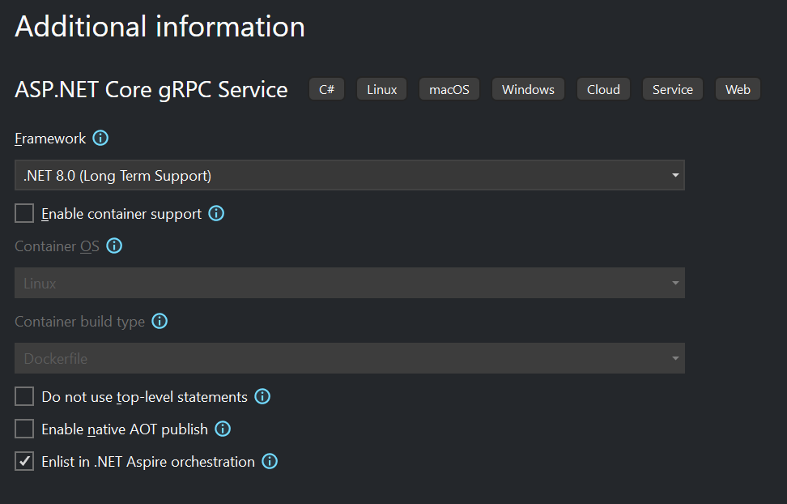

# Add shopping basket capabilities to the web site

In previous labs, we have created a web site that shoppers can use to browser a through pages of products, optionally with filtering by brand or type, and added the ability for users to create an account and sign in. In this lab, we will add the capability to add products to a shopping basket. The shopping basket will be stored in Redis, and exposed via a new gRPC service that the web site will communicate with.

1. Add a new project called `Basket.API` to the solution using the **ASP.NET Core gRPC Service** template. Ensure that the following template options are configured:

    - Framework: **.NET 8.0 (Long Term Support)**
    - Enable Docker: **disabled**
    - Do not use top-level statements: **disabled**
    - Enable native AOT publish: **disabled**
    - Elinst in .NET Aspire orchestration: **enabled**

    

1. Open the `Basket.Api.csproj` file add a line to change the default root namespace of the project to `eShop.Basket.API`:

    ```xml
    <RootNamespace>eShop.Basket.API</RootNamespace>
    ```

1. Open the `Program.cs` file in the `eShop.AppHost` project and add a line to create a new Redis resource named `"BasketStore"` and configure it to host a [Redis Commander](https://joeferner.github.io/redis-commander/) instance too (this will make it easier to inspect the Redis database during development). Capture the resource in a `basketStore` variable:

    ```csharp
    var basketStore = builder.AddRedis("BasketStore").WithRedisCommander();
    ```

    Aspire will automatically create containers for both Redis and Redis Commander  when the application is run.

1. Find the line that was added to add the `Basket.API` gRPC project to the AppHost as a resource. Update the code to name the resource `"basket-api"`, make it reference the `idp` and `BasketStore` resources, and capture it in a `basketApi` variable:

    ```csharp
    var basketApi = builder.AddProject<Projects.Basket_API>("basket-api")
        .WithReference(idp)
        .WithReference(basketStore);
    ```

    The `Basket.API` will require calls to be authenticated by the IdP, and will need to access the Redis database to store and retrieve shopping baskets.

1. Update the `webapp` resource to reference the `basket-api` resource so the web site can communicate with the Basket API:

    ```csharp
    var webApp = builder.AddProject<Projects.WebApp>("webapp")
        .WithReference(catalogApi)
        .WithReference(basketApi) // <--- Add this line
        .WithReference(idp)
        // Force HTTPS profile for web app (required for OIDC operations)
        .WithLaunchProfile("https");
    ```

1. Run the AppHost project and verify that the containers for Redis and Redis Commander are created and running by using the dashboard. Also verify that the `Basket.API` project is running and that it's environment variables contain the configuration values to communicate with the IdP and Redis.

1. Following the pattern we've used in our other projects, create a new file `HostingExtensions.cs` in an `Extensions` directory in the `Basket.API` project and add a class to it called `HostingExtensions`. Add a method to the class called `AddApplicationServices`:

    ```csharp
    namespace Microsoft.Extensions.Hosting;

    public static class HostingExtensions
    {
        public static IHostApplicationBuilder AddApplicationServices(this IHostApplicationBuilder builder)
        {

            return builder;
        }
    }

    ```

    We'll add code here later to configure the services in the application's DI container as we build out the Basket API.

1. In the `Program.cs` file, add a call to the `AddApplicationServices` method after the call to `AddServiceDefaults`:

    ```csharp
    builder.AddServiceDefaults();
    builder.AddApplicationServices();
    ```

1. To communicate with Redis we'll use the [Aspire StackExchange Redis component](https://learn.microsoft.com/dotnet/aspire/caching/stackexchange-redis-component). Aspire components are NuGet packages that integrate common client libraries with the Aspire stack, ensuring that they're configured with the application's DI container and setup for observability, reliability, and configurability.

    Add the `Aspire.StackExchange.Redis` component NuGet package to the `Basket.API` project. You can use the **Add > .NET Aspire Compoenent...** project menu item in Visual Studio, the `dotnet add package` command at the command line, or by editing the `Basket.API.csproj` file directly:

    ```xml
    <PackageReference Include="Aspire.StackExchange.Redis" Version="8.0.0-preview.3.24105.21" />
    ```

1. In the `AddApplicationServices` method in `HostingExtensions.cs`, add a call to `AddRedis` to configure the Redis client in the application's DI container. Pass the name `"BasketStore"` to the method to indicate that the client should be configured to connect to the Redis resource with that name in the AppHost:

    ```csharp
    public static IHostApplicationBuilder AddApplicationServices(this IHostApplicationBuilder builder)
    {
        builder.AddRedis("BasketStore");

        return builder;
    }
    ```

    Now, to use the Redis client in the application, we simply need to accept a constructor parameter of type [`IConnectionMultiplexer`](https://stackexchange.github.io/StackExchange.Redis/Basics)

1. gRPC services are defined using [Protocol Buffers (protobuf)](https://protobuf.dev/) files. Add a new file called `basket.proto` to the `Protos` directory in the `Basket.API` project. Add the following content to the file:

    ```protobuf
    syntax = "proto3";

    option csharp_namespace = "eShop.Basket.API.Grpc";

    package BasketApi;

    service Basket {
        rpc GetBasket(GetBasketRequest) returns (CustomerBasketResponse) {}
        rpc UpdateBasket(UpdateBasketRequest) returns (CustomerBasketResponse) {}
    }

    message GetBasketRequest {
    }

    message UpdateBasketRequest {
        repeated BasketItem items = 1;
    }

    message BasketItem {
        int32 product_id = 1;
        int32 quantity = 2;
    }

    message CustomerBasketResponse {
        repeated BasketItem items = 1;
    }
    ```

    This file defines a gRPC service called `Basket` with two methods: `GetBasket` and `UpdateBasket`. The `GetBasket` method takes a `GetBasketRequest` message and returns a `CustomerBasketResponse` message with a repeated `BasketItem` field. The `UpdateBasket` method takes an `UpdateBasketRequest` message with a repeated `BasketItem` field and also returns a `CustomerBasketResponse`.

1. Delete the `greeter.proto` file that was included with the template.

1. Update the `Basket.API.csproj` file to add the `basket.proto` file as a `Protobuf` item in the project and set the `GrpcServices` metadata to `"Server"` to indicate that it should be used to generate server-side code for the gRPC service:

    ```xml
    <ItemGroup>
        <Protobuf Include="Protos\basket.proto" GrpcServices="Server" />
    </ItemGroup>
    ```

    The project system will automatically generate code behind the scenes to represent the messages and service defined in the `basket.proto` file. We'll use these generated types in our service implementation.

1. Add a new file `BasketService.cs` in a `Grpc` directory and define a class in it named `BasketService` that derives from `Basket.BasketBase`:

    ```csharp
    namespace eShop.Basket.API.Grpc;

    public class BasketService : Basket.BasketBase
    {

    }
    ```

1. In the `Program.cs` file, update the line that maps the `GreeterService` gRPC service so that it maps the `BasketService` instead:

    ```csharp
    builder.MapGrpcService<BasketService>();
    ``` 

1. Delete the `Services/GreeterSrevice.cs` file that was included with the template, including the `Services` directory.

1. 