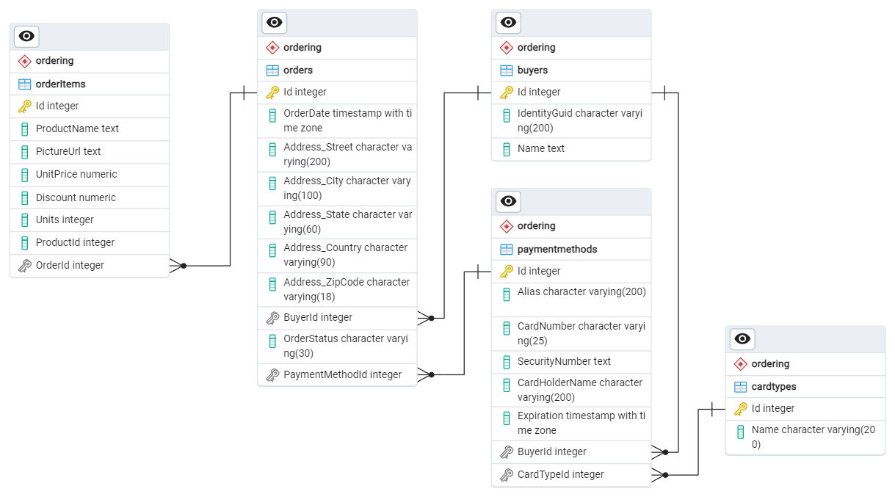
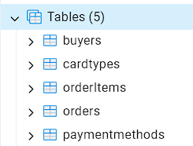
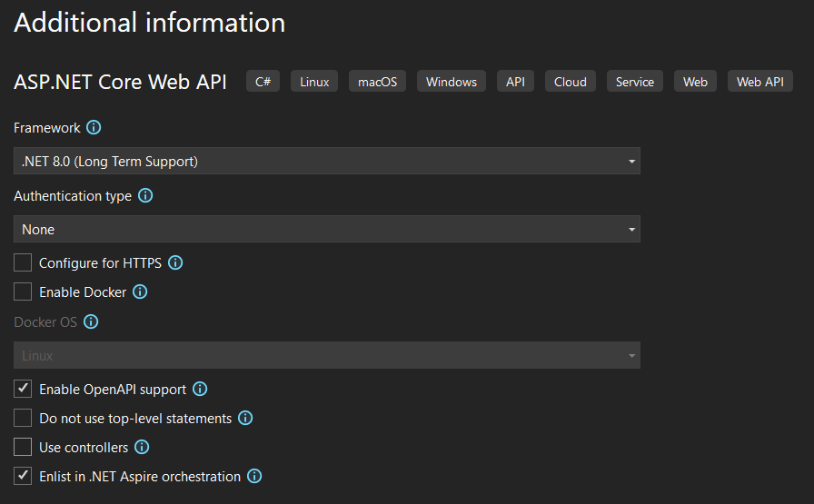
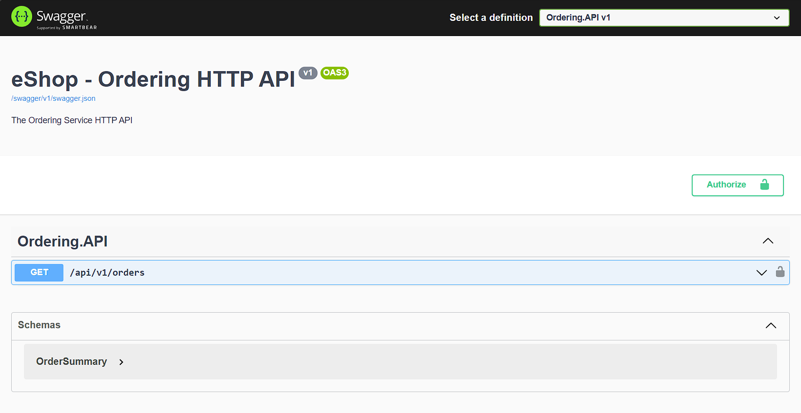
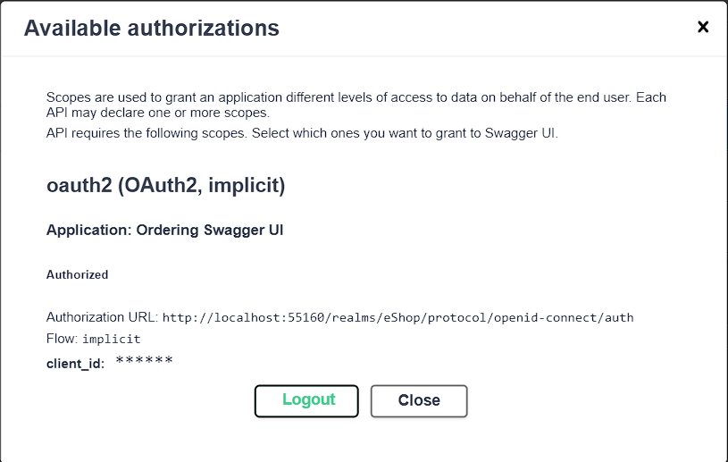
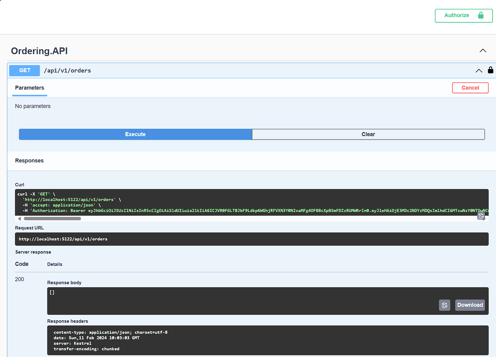
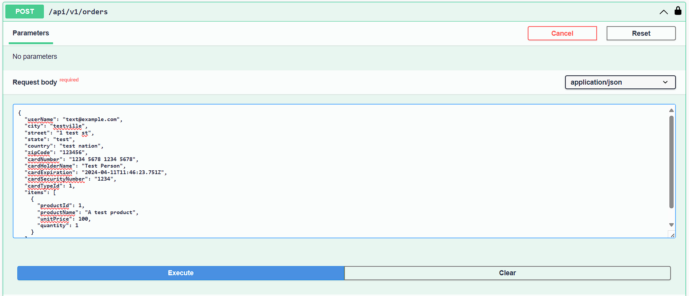
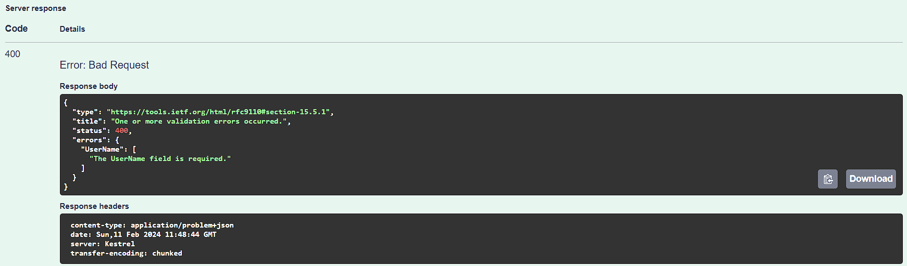

# Add checkout functionality to the web site

Similar to [lab 1](../1-Create-Catalog-API/README.md), a database has already been defined to store order details for eShop, along with an Entity Framework Core model, and a web app that ensures the database is created and updated to the latest schema by running migrations on startup.



## Getting familiar with the Ordering Database

1. Open the [`eShop.lab5.sln`](./src/eShop.lab5.sln) in Visual Studio or VS Code.
1. An Entity Framework Core model is already defined for this database in the `Ordering.Data` project. Open the `OrderingDbContext.cs` file in this project and look at the code to see that the the various tables are defined via properties and [classes implementing `IEntityTypeConfiguration<TEntity>`](https://learn.microsoft.com/ef/core/modeling/#grouping-configuration).
1. The `Ordering.Data` project only defines the `DbContext` and entity types. The [EF Core migrations](https://learn.microsoft.com/ef/core/managing-schemas/migrations/) are defined and managed in the `Ordering.Data.Manager` project. This is a web project that includes some custom code to facilitate creating and seeding the database when the application starts.
1. The AppHost has already been configured to create a PostgreSQL container resource named `OrderingDB` and had the `Ordering.Data.Manager` project added to it as a resource named `ordering-db-mgr` with a reference to the `OrderingDB` database.
1. Run the AppHost project and verify using the dashboard and the **pgAdmin** tool that the `OrderingDB` database has been created and contains the tables defined by the Entity Framework Core migrations.

    

## Create the Ordering API project

Now that we've verified the Ordering database is working, let's add an HTTP API that provides the ordering capabilities to our system.

1. Add a new project to the solution using the **ASP.NET Core Web API** project template and call it `Ordering.API`, and ensure the following options are configured
    - Framework: **.NET 8.0 (Long Term Support)**
    - Configure for HTTPS: **disabled**
    - Enable Docker: **disabled**
    - Enable OpenAPI support: **enabled**
    - Do not use top-level statements: **disabled**
    - Use controllers: **disabled**
    - Enlist in .NET Aspire orchestration: **enabled**

    

1. In the newly created project, update the package reference to `Swashbuckle.AspNetCore` to version `6.5.0`
1. Open the `Program.cs` file of the `eShop.AppHost` project, and update it so the API project you just added is named `"ordering-api"` and has a reference to the `OrderingDB` and the IdP:

    ```csharp
    var orderingApi = builder.AddProject<Projects.Ordering_API>("ordering-api")
        .WithReference(orderDb)
        .WithReference(idp);
    ```

1. Towards the bottom of the `Program.cs` file, udpate the line that adds the `"ORDERINGAPI_HTTP"` envionment variable to the `idp` resource so that it now passes in the `http` endpoint from the `orderingApi` resource. This will ensure the IdP is configured correctly to support authentication requests from the `Ordering.API` project:

    ```csharp
    idp.WithEnvironment("ORDERINGAPI_HTTP", orderingApi.GetEndpoint("http"));
    ```

1. Add a project reference from the `Ordering.API` project to the `Ordering.Data` project so that it can use Entity Framework Core to access the database.
1. Open the `Program.cs` file of the `Ordering.API` project and delete the sample code that defines the weather forecasts API.
1. Immediately after the line that calls `builder.AddServiceDefaults()`, add lines to register the default OpenAPI services, and the default authentication services. Reminder, these methods are defined in the `eShop.ServiceDefaults` project and make it easy to add common services to an API project and ensure they're configured consistently:

    ```csharp
    builder.AddServiceDefaults();
    builder.AddDefaultOpenApi();
    builder.AddDefaultAuthentication();
    ```

1. Add a line to configure the `OrderingDbContext` in the application's DI container using the [**Npgsql Entity Framework Core Provider**](https://www.npgsql.org/efcore/index.html) for PostgreSQL. Ensure that the name passed to the method matches the name defined for the database in the AppHost project's `Program.cs` file (`"OrderingDB"`). The `AddNpgsqlDbContext` method comes from the [`Aspire.Npgsql.EntityFrameworkCore.PostgreSQL` Aspire component](https://learn.microsoft.com/dotnet/aspire/database/postgresql-entity-framework-component):

    ```csharp
    builder.AddNpgsqlDbContext<OrderingDbContext>("OrderingDB");
    ```

1. Create a new file called `OrdersApi.cs` and define a static class inside of it called `OrderingApi` in the `Microsoft.AspNetCore.Builder` namespace:

    ```csharp
    namespace Microsoft.AspNetCore.Builder;

    public static class OrderingApi
    {
        
    }
    ```

1. In this class, add an extension method named `MapOrdersApi` on the `RouteGroupBuilder` type, returning that same type:

    ```csharp
    public static RouteGroupBuilder MapOrdersApi(this RouteGroupBuilder app)
    {
        
        return app;
    }
    ```

    This method will define the endpoint routes for the Ordering API.

1. Create a `Models` directory and inside it create a new file `OrderSummary.cs`. In this, define a class called `OrderSummary` with properties to represent the order number, date, status, and total price, and a static method to create an instance of this class from an `Order` entity from the `Ordering.Data` project:

    ```csharp
    using eShop.Ordering.Data;

    namespace eShop.Ordering.API.Model;

    public class OrderSummary
    {
        public int OrderNumber { get; init; }

        public DateTime Date { get; init; }

        public required string Status { get; init; }

        public decimal Total { get; init; }

        public static OrderSummary FromOrder(Order order)
        {
            return new OrderSummary
            {
                OrderNumber = order.Id,
                Date = order.OrderDate,
                Status = order.OrderStatus.ToString(),
                Total = order.GetTotal()
            };
        }
    }
    ```

    This class will be used to represent a summary of an order in the API responses.

1. Back in the `OrdersApi.cs` file, in the `MapOrdersApi` method, add a call to `app.MapGet` to define an endpoint that responds to GET requests to the `/` path, and is handled by an async lambda that accepts two parameters: a `ClaimsPrincipal` type that will be auto-populated with the current user, and the `OrderingDbContext` instance that will come from the DI container:

    ```csharp
    app.MapGet("/", async (ClaimsPrincipal user, OrderingDbContext dbContext) =>
    {
        
    });
    ```

1. Add code to the lambda body to extract the user ID from the `ClaimsPrincipal` and use it to query the database for the orders that belong to that user. If the user ID is null, throw an exception with a relevant message, otherwise return an instance of `OrderSummary` representing the user's orders:

    ```csharp
    app.MapGet("/", async (ClaimsPrincipal user, OrderingDbContext dbContext) =>
    {
        var userId = user.GetUserId()
            ?? throw new InvalidOperationException("User identity could not be found. This endpoint requires authorization.");

        var orders = await dbContext.Orders
            .Include(o => o.OrderItems)
            .Include(o => o.Buyer)
            .Where(o => o.Buyer.IdentityGuid == userId)
            .Select(o => OrderSummary.FromOrder(o))
            .AsNoTracking()
            .ToArrayAsync();

        return TypedResults.Ok(orders);
    });
    ``` 

1. In `Program.cs`, immediately before the call to `app.Run()` at the end of the file, add a line to map a route group for the path `/api/v1/orders` and call the `MapOrdersApi` method on it, followed by a call to `RequireAuthorization` to ensure that the endpoint requires a user to be authenticated to access it. This will ensure that the endpoint is only accessible to authenticated users, and that the user's identity is available in the `ClaimsPrincipal` parameter of the lambda in the `MapGet` method:

    ```csharp
    app.MapGroup("/api/v1/orders")
       .MapOrdersApi()
       .RequireAuthorization();
    ```

1. Open the `appsettings.json` file and add the following configuration sections:

    ```json
    {
        // Add the following sections
        "OpenApi": {
            "Endpoint": {
                "Name": "Ordering.API v1"
            },
            "Document": {
                "Description": "The Ordering Service HTTP API",
                "Title": "eShop - Ordering HTTP API",
                "Version": "v1"
            },
            "Auth": {
                "ClientId": "orderingswaggerui",
                "AppName": "Ordering Swagger UI"
            }
        },
        "Identity": {
            "Audience": "orders"
        }
    }
    ```

    The `"OpenApi"` section will ensure the call to `builder.AddDefaultOpenApi()` in the `Program.cs` file configures the Swagger UI for authentication against our IdP. The `"Identity"` section will ensure the call to `builder.AddDefaultAuthentication()` in the `Program.cs` file configures the API for authentication bia JWT Bearer (similar to what we did for the Basket API).

1. Run the AppHost project and verify that the `Ordering.API` project is running and that the `/api/v1/orders` endpoint is visible in the Swagger UI. There should be an **Authorize** button displayed with an open padlock, indicating that the endpoint requires authentication.

    

1. Click the **Authorize** button and in the **Available authorizations** dialog opened, click the **Authorize** button to be taken to the sign-in form for the IdP. Sign in with the same test user you used to sign in to the web site in the previous lab (*test@example.com / P@$$w0rd1*). You should be redirected back to the Swagger UI and see the **Available authorizations** dialog again indicating you are now authorized.

    

1. Click the **Close** button to close the **Available authorizations** dialog and then click the **Try it out** button for the `/api/v1/orders` endpoint. You should see a response with an empty array of orders, indicating that the endpoint is working and returning the expected response.

    

## Add an API endpoint to create an order

1. In the `Ordering.API` project, add a new file called `BasketItem.cs` in the `Models` directory. In this file, define a class called `BasketItem` with properties to represent an item in a shopping basket that will be added to an order. Annotate all the properties with the `[Required]` attribute from the `System.ComponentModel.DataAnnotations` namespace, and use the `[Range]` attribute to specify a range of valid values for the numerical properties:

    ```csharp
    using System.ComponentModel.DataAnnotations;

    namespace eShop.Ordering.API.Models;

    public class BasketItem
    {
        [Required]
        public int ProductId { get; init; }

        [Required]
        public required string ProductName { get; init; }

        [Required, Range(0, double.MaxValue)]
        public decimal UnitPrice { get; init; }

        [Required]
        [Range(0, 10000)]
        public int Quantity { get; init; }
    }
    ```

1. Add another new file called `CreateOrderRequest.cs` in the `Models` directory. In this file, define a class called `CreateOrderRequest` with properties to represent the details of the order. Annotate all the properties with the `[Required]` attribute from the `System.ComponentModel.DataAnnotations` namespace:

    ```csharp
    using System.ComponentModel.DataAnnotations;

    namespace eShop.Ordering.API.Models;

    public class CreateOrderRequest
    {
        [Required]
        public required string UserName { get; set; }

        [Required]
        public required string City { get; set; }

        [Required]
        public required string Street { get; set; }

        [Required]
        public required string State { get; set; }

        [Required]
        public required string Country { get; set; }

        [Required]
        public required string ZipCode { get; set; }

        [Required]
        public required string CardNumber { get; set; }

        [Required]
        public required string CardHolderName { get; set; }

        [Required]
        public DateTime CardExpiration { get; set; }

        [Required]
        public required string CardSecurityNumber { get; set; }

        [Required]
        public int CardTypeId { get; set; }

        [Required]
        public required IReadOnlyCollection<BasketItem> Items { get; set; }
    }
    ```
1. Back in the `OrdersApi.cs` file, in the `MapOrdersApi` method, add a call to `app.MapGet` to define an endpoint that responds to POST requests to the `/` path, and is handled by an async lambda that accepts three parameters: a `CreateOrderRequest` that will be deserialized from JSON in the POST request body, a `ClaimsPrincipal` type that will be auto-populated with the current user, and the `OrderingDbContext` instance that will come from the DI container:

    ```csharp
    app.MapPost("/", async (CreateOrderRequest request, ClaimsPrincipal user, OrderingDbContext dbContext) =>
    {
        
    });
    ```

1. We'll build up the body of this lambda over a few steps as the process of creating an order from a basket is a bit more complex than just querying the database for orders. First, add code to the lambda body to extract the user ID from the `ClaimsPrincipal`. If the user ID is null, throw an exception with a relevant message:

    ```csharp
    app.MapPost("/", async (CreateOrderRequest request, ClaimsPrincipal user, OrderingDbContext dbContext) =>
    {
        var userId = user.GetUserId()
            ?? throw new InvalidOperationException("User identity could not be found. This endpoint requires authorization.");

        // ... more code to come
    });
    ```

1. Next, add code to validate that the `CardTypeId` property of the `request` parameter is a valid card type ID. If it's not, return a validation problem response with an appropriate message:

    ```csharp
    if (!Enumeration.IsValid<CardType>(request.CardTypeId))
    {
        var errors = new Dictionary<string, string[]>
        {
            { nameof(CreateOrderRequest.CardTypeId), [$"Card type ID '{request.CardTypeId}' is invalid."] }
        };
        return Results.ValidationProblem(errors);
    }
    ```

1. Next, we'll query the database to find the buyer that corresponds to the current user, and retrieve the requested payment method at the same time if the buyer has used it previously:

    ```csharp
    var requestPaymentMethod = new PaymentMethod
    {
        CardTypeId = request.CardTypeId,
        CardHolderName = request.CardHolderName,
        CardNumber = request.CardNumber,
        Expiration = request.CardExpiration,
        SecurityNumber = request.CardSecurityNumber,
    };

    var buyer = await dbContext.Buyers
        .Where(b => b.IdentityGuid == userId)
        // Include the payment method to check if it already exists
        .Include(b => b.PaymentMethods
            .Where(pm => pm.CardTypeId == requestPaymentMethod.CardTypeId
                        && pm.CardNumber == requestPaymentMethod.CardNumber
                        && pm.Expiration == requestPaymentMethod.Expiration))
        .SingleOrDefaultAsync();
    ```

1. Now check if the buyer was found, and if not, create a new buyer for this user and add it to the database:

    ```csharp
    if (buyer is null)
    {
        buyer = new Buyer
        {
            IdentityGuid = userId,
            Name = request.UserName
        };
        dbContext.Buyers.Add(buyer);
    }
    ```

1. Next, check if the payment method was found, and if not, add it to the buyer's payment methods:

    ```csharp
    var paymentMethod = buyer.PaymentMethods.SingleOrDefault();

    if (paymentMethod is null)
    {
        paymentMethod = new PaymentMethod
        {
            CardTypeId = request.CardTypeId,
            CardNumber = request.CardNumber,
            CardHolderName = request.CardHolderName,
            Expiration = request.CardExpiration,
            SecurityNumber = request.CardSecurityNumber
        };
        buyer.PaymentMethods.Add(paymentMethod);
    }
    ```

1. Now that the buyer and payment method are dealth with, we can actually create the order:

    ```csharp
    var order = new Order
    {
        Buyer = buyer,
        Address = new Address(request.Street, request.City, request.State, request.Country, request.ZipCode),
        OrderItems = request.Items.Select(i => new OrderItem
        {
            ProductId = i.ProductId,
            ProductName = i.ProductName,
            UnitPrice = i.UnitPrice,
            Units = i.Quantity,
            Discount = 0
        }).ToList(),
        PaymentMethod = paymentMethod
    };

    dbContext.Orders.Add(order);
    ```

1. Finally, save the changes to the database and return an OK response to indicate that the operation completed successfully:

    ```csharp
    await dbContext.SaveChangesAsync();

    return TypedResults.Ok();
    ```

## Add parameter validation to the API

We decorated some of the properties of the types that will be deserialized from the requests to the API with the `[Required]` and `[Range]` attributes, but ASP.NET Core Minimal APIs currently doesn't support validation out of the box. We can add this functionality by referencing a NuGet package that provides an endpoint filter to handle validating endpoint parameters:

1. Add a reference to the `MinimalApis.Extensions` NuGet package, version `0.11.0` to the `Ordering.API` project.
1. Update the `MapPost` call in `OrdersApi.cs` so that it calls `WithParameterValidation` on the returned `RouteHandlerBuilder` instance to enable parameter validation for the endpoint.

    You can optionally set the `requireParameterAttribute` parameter to `true` to ensure that the `[Validate]` attribute is required on the endpoint parameters to enable validation. This makes parameter validation more explicit so that other parameters are not uncessarily validated, potenially improving performance. If you opt to set this parameter to `true`, you'll need to ensure add the `[Validate]` attribute to the `CreateOrderRequest` parameter too:

    ```csharp
    app.MapPost("/", async ([Validate] CreateOrderRequest request, ClaimsPrincipal user, OrderingDbContext dbContext) =>
        {
            // ... existing code
        })
        .WithParameterValidation(requireParameterAttribute: true); // <-- Add this line
    ```

1. Run the AppHost project and verify that the `Ordering.API` project is running and that the `/api/v1/orders` endpoint is visible in the Swagger UI. Experiment with authorizing and making requests to the endpoint to ensure that it's working as expected, including the parameter validation. Once you've created an order via a POST to the `/api/v1/orders` endpoint, you should see the order returned when making a GET request to the same endpoint.

    Here's an example of successfully creating an order using the Swagger UI:

    

    Here's an example of the type of response you'll receive if you try to create an order with invalid parameters:

    

## Challenge: Add the Checkout feature to the web site

If you want an extra challenge, try updating the web site to call the Ordering API. You can use the complete `eShop` solution in the root of this repo to help guide you.
